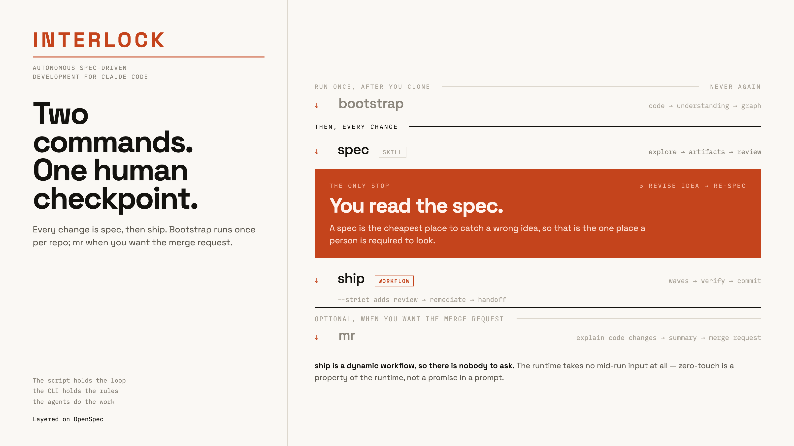

# Interlock

**Autonomous spec-driven development for Claude Code, layered on [OpenSpec](https://github.com/Fission-AI/OpenSpec).**

One human checkpoint. Spec a change, read it, then ship it start-to-commit with parallel agents.

```bash
/plugin marketplace add renzrollon/interlock
/plugin install interlock@interlock
```

Then, in a repo, onboard once:

```bash
/interlock:bootstrap          # code → understanding → graph
```

Every change after that:

```bash
/interlock:spec "<idea>"      # explore → artifacts → review, then stops
/interlock:ship               # waves → verify → commit
/interlock:ship --strict      # previous default: + review, handoff, conformance
```

| Requirement | Why |
|---|---|
| [Claude Code](https://claude.com/claude-code) **v2.1.154+** | `/interlock:ship` launches a [dynamic workflow](https://code.claude.com/docs/en/workflows). Known-good on 2.1.229 |
| Dynamic workflows **enabled** | Off via `disableWorkflows`, org policy, or `CLAUDE_CODE_DISABLE_WORKFLOWS` means no `ship`. On Pro, enable it in `/config` |
| `CLAUDE_CODE_SUBAGENT_MODEL` **unset** | If it is set it overrides every per-tier model the planner assigns, so `ship` runs entirely on that model. It banners this rather than hiding it — see [when it stops](docs/04-when-it-stops.md) |
| [`openspec`](https://github.com/Fission-AI/OpenSpec) CLI | Interlock drives it; it does not replace it |
| Node.js ≥ 18 | For the two bundled CLIs |

### Installing the OpenSpec dependency

Interlock drives the `openspec` CLI, so install it and initialize it in the repo first ([OpenSpec quick start](https://github.com/Fission-AI/OpenSpec#quick-start)):

```bash
npm install -g @fission-ai/openspec@latest
```

```bash
cd your-project && openspec init
```

OpenSpec itself requires **Node.js 20.19.0+** (higher than Interlock's own ≥ 18) and also installs via pnpm, yarn, bun or nix. `openspec init` creates `openspec/` and installs its stock skills — Interlock composes with those rather than replacing them.

**Interlock is a Claude Code plugin.** It relies on Claude Code's skill frontmatter, plugin `bin/` PATH injection, subagent fan-out, and the workflow runtime — Cursor and Copilot are not supported in 0.x.

Before a long `ship` run, allowlist the commands its agents use (`interlock`, `interlock-graph`, `openspec`, `git`, and your test runner). Workflow agents inherit your permission settings, so a command that is not allowlisted stops the run on an approval prompt — which is exactly what a zero-touch run should never do.

New here? Start with **[the first hour](docs/01-first-hour.md)**.

| Doc | |
|---|---|
| [01 — The first hour](docs/01-first-hour.md) | Install to first shipped change |
| [02 — The checkpoint](docs/02-the-checkpoint.md) | How to read a spec in ten minutes |
| [03 — OpenSpec vs Interlock](docs/03-openspec-vs-interlock.md) | What composes with what |
| [04 — When it stops](docs/04-when-it-stops.md) | Every halt and banner, and what to do |
| [06 — Why it works](docs/06-why-it-works.md) | The mechanisms, low-level, with the costs stated |

---

## The flow

One human stop. Everything else is automatic.

<p align="center">
  
</p>

**The gap between `spec` and `ship` is the product.** A spec is the cheapest place to catch a wrong idea, so that is the one place a person is *required* to look.

`/interlock:ship` is the one that truly asks nothing, and it is structurally incapable of it: ship is a **dynamic workflow**, and the workflow runtime takes no mid-run user input at all. The zero-touch contract is a property of the runtime rather than a promise in a prompt. Default ship is waves → unit verify → commit. Pass `--strict` when you want the adversarial review and handoff tail. `commit` and `mr` set `disable-model-invocation: true` for the same reason — Claude cannot decide on its own that now is a good time to commit.

The steps before it are conversational where they have to be: `spec` asks about intent, bug-fix evidence, and dependency versions it refuses to guess — questions with no correct answer available in the repo. That is also why every decision that could need a human has to be settled *before* ship starts. Once the workflow is running, there is nobody to ask.

---

## Why this and not a folder of prompts

Decisions that have a correct answer are moved out of prose and into code, one at a time. The plugin ships two CLIs on your `PATH`:

**`interlock`** — the deterministic spine. Each subcommand replaces a judgement the model used to re-derive in prose on every run, usually inconsistently:

| Command | Decides |
|---|---|
| `interlock waves` | Wave order, per-task model, a **hard cap on parallel agents**, and whether two tasks in one wave would edit the same file |
| `interlock surface` | Whether a diff touches UI, and therefore needs a manual test plan |
| `interlock gate` | Whether a review blocks, which findings are too weak to report, and how the rest partition for parallel fixers |
| `interlock review` | Which findings survive two skeptics, and how many were dismissed versus dropped as too weak |
| `interlock remediate` | What gets fixed, what gets deferred, and when the round budget is spent |
| `interlock verify` | What to run, what a red result means, and which failures share a root cause |
| `interlock wave-state` | What happens next in the wave loop, and when to stop |
| `interlock risk` | How dangerous a change is, from its paths and artifacts |
| `interlock drift` | Which completed changes were never archived, which specs cite files that are gone, and which changed files no spec describes |
| `interlock conformance` | Which spec scenarios a change must be checked against — the questions, never the verdicts |
| `interlock ready` | Whether a change may skip the human checkpoint — fail-closed |
| `interlock validate` | Whether a change is actually implementable |
| `interlock limits` | Every cap the loop obeys, so nothing restates one |

Every one of them runs without a model and without the network, so you can check any decision the loop made yourself.

**`interlock-graph`** — a local, deterministic code knowledge graph. No vector store, no network. Agents navigate with token-budgeted subgraphs instead of re-grepping:

```bash
interlock-graph build .
interlock-graph consumers normalizeEmail
interlock-graph path lib/auth app/api
```

Everything genuinely requiring judgement — classification, implementation, review, synthesis — stays with the model. The split is the point: **the script holds the loop, the CLI holds the rules, the agents do the work.**

The wave loop, the halt conditions and the verification order are `workflows/ship.js` — a script, not numbered headings a model is asked to follow. Control flow written as prose is control flow the model can talk itself out of. Default `ship` is that loop through to a green unit suite and a commit. Adversarial review and handoff artifacts are `--strict` (or `--review` / `--handoff` on their own), not the execute loop itself.

That leaves one thing worth calling out because it took the longest to close: tasks in a wave run in parallel **in one working tree**, and their independence used to be asserted by the classifier and checked by nothing. The planner now takes each task's predicted file list and moves any task that would collide with a sibling into its own wave. The prediction is a model's, so this narrows the race rather than closing it — but the assumption is now stated and checked instead of merely assumed.

---

## Reviews you can actually read

`/interlock:review-code` fans out up to six dimensions in parallel — language, architecture, QA and delivery always; devops and security when the diff earns them — then **puts two skeptics on every blocker and warning and tries to refute it.** Findings that don't survive are never shown to you.

An unverified review reports everything it notices, so you learn to skim it. A review where every finding survived two adversaries is one you read line by line. The report always tells you how many findings were dismissed — that number is the evidence it's worth trusting.

**A skeptic must cite what it read to dismiss a finding.** A verdict of "not real" carrying no `file:line` span does not dismiss anything: it is recorded, its quality score still counts, and the finding survives to you. Voting a finding *real* needs no citation, because that direction already ends with a human reading it — the cheap error. Only the dismissing direction is gated, because a wrongly dismissed finding is *invisible*, and nobody can catch a mistake they never see. [Research on adversarial review](https://arxiv.org/pdf/2604.19049) documents where uncited refutation ends: eighty-plus agents, dedicated skeptics among them, unanimously endorsing an OpenSSL vulnerability that did not exist. Confident prose is the one thing an LLM produces reliably, so it is the one thing a dismissal must not rest on.

Surviving is not sufficient. `interlock gate` also applies a quality band: a finding the skeptics scored too low for how well-grounded and actionable it is gets dropped before the gate counts blockers, so a vague blocker cannot hold up a change. That threshold lives in the CLI rather than in the review prose, which is what stops it from being quietly re-argued on each run.

---

## Commands

`bootstrap` once per repo. Then `spec` and `ship` on every change. `mr` when you want the merge request.

| | | |
|---|---|---|
| `bootstrap` | Onboard a repo — once | skill |
| `spec` | Idea → reviewed, implementation-ready change | skill |
| `ship` | Reviewed change → commit (waves → verify → commit). `--strict` adds review and handoff | **workflow** (skill trampoline) |
| `mr` | Change → merge request | skill |

`ship` is the odd one out on purpose: a skill is instructions Claude follows, a workflow is a script a runtime executes. `/interlock:ship` is a thin skill that only launches `workflows/ship.js`, so the Skill tool can find it in any repo where the plugin is installed. The loop stays in the script.

<details>
<summary><b>Advanced surface</b> — mostly called by the four above; reach for them directly only when you know why</summary>

<br>

| | |
|---|---|
| `explore` | Parallel read-only reconnaissance, durable brief |
| `review-code` · `review-artifacts` | The adversarial gates, run standalone. Default `ship` does not run `review-code`; pass `--review` or `--strict`. |
| `graph` · `docs-digest` | Build and query the local code graph and docs digest |
| `fix-tests` | Discover the test setup, then repair failures by root cause |
| `manual-test-plan` · `explain-code` · `commit` | Individual `ship` stages, run on their own |
| `dispatch` | One batched pre-flight, then routes you to the right skill |

None of these are part of a first loop — see [the first hour](docs/01-first-hour.md).

</details>

---

## It composes OpenSpec — it doesn't replace it

`openspec init` installs its own `openspec-propose`, `openspec-explore` and `openspec-apply-change` skills. Interlock does **not** fork them. `/interlock:spec` drives the `openspec` CLI directly — `openspec new change`, `openspec status --json`, `openspec instructions` — because the CLI is the stable contract and a forked skill drifts on every OpenSpec release.

What Interlock adds around it: parallel exploration with a durable brief, an evidence gate for bug fixes, invariant sweeps, wave execution with mechanical caps, optional adversarial review (`--strict` or `/interlock:review-code`), and the deterministic spine above.

Both sets of skills coexist. Plugin skills are namespaced, so `/openspec-propose` and `/interlock:spec` both stay available. Use `/interlock:spec` when you want the gates; use the stock skills when you want the plain artifact loop.

### Specs that don't quietly rot

Spec drift is the standing criticism of every tool in this category, and the usual answers are to delete the spec after shipping or to leave it to discipline. OpenSpec's `openspec archive` merges a completed change's deltas back into the living specs — Interlock never archives for you, it just stops the step being forgotten:

```bash
interlock drift --changed <files>
```

Four findings, deliberately kept at **different confidence** rather than averaged into one number: changes that finished but were never archived (certain — read off the filesystem); specs citing files that no longer exist (evidence — the file was there when the graph was built); changed source files no spec describes, always reported with a repo-wide coverage figure so the count means something; and specs older than code they cite (an inference from dates, printed last and labelled as such).

`interlock conformance` is the other half: it lists the scenarios a change's delta specs promised, so each can be checked against what was actually built. It emits questions, never verdicts.

**Neither blocks.** Every other subcommand exits non-zero when it blocks; these two never do. A gate built on regex-inferred spec→file links would be wrong often enough to get switched off, and a gate everyone disables protects nothing.

---

## Language support

Structural graph indexing — import and symbol edges — covers **JavaScript/TypeScript, Python, and shell**. Other languages (Go, Rust, Java, Ruby) get everything else: docs and OpenSpec indexing, spec→file links, prose retrieval, and the full workflow. When `interlock-graph build` finds nothing to index it says so and explains why, rather than reporting an empty graph as success.

Everything else in the plugin is stack-agnostic. `bootstrap` reads your dependency manifest and phrases its explorer agents in your stack's vocabulary.

---

## How it compares

Most of the category competes on how much structure you write before coding — Spec Kit adds phases, BMAD adds roles, Kiro adds an IDE. Interlock competes on a different axis: **how many decisions the model is not allowed to make.**

- **Caps and gates are code.** Remediation rounds, the task-failure budget, parallelism, the review quality floor — all in a tested CLI, not in markdown a model can talk itself past.
- **The zero-touch contract is the runtime's, not a prompt's.** `ship` is a workflow, so there is nobody to ask. Everyone else promises autonomy in prose. Default ship is waves → verify → commit; `--strict` is the review/handoff tail.
- **A dismissal must cite evidence; a report needn't.** On `--review` / `--strict` or `/interlock:review-code`, findings are attacked before you see them, dismissal counts are printed, and a refutation that cites nothing refutes nothing.
- **The invariant sweep is the licensed exception to the diff leash** — a value canonicalized in one place and still read raw in three others is the one bug class every diff-scoped review is structurally blind to.
- **Spec drift is measured, not hand-waved** — and reported at three separate confidence levels rather than one misleading number.

The trade is portability. Spec Kit runs on thirty agents; Interlock runs on one, because the guarantees above come from Claude Code's workflow runtime and its plugin surface. A portable version of this would be a folder of prompts, which is the thing it exists not to be.

---

## Experimental

**Earned autonomy** is an internal ledger. `interlock autonomy` records per-path run outcomes (`review-code`, artifact review, and `ship --strict`) and `interlock outcomes` accumulates one line per ship run, but **nothing reads either to change what the workflow does** — the human checkpoint between `spec` and `ship` is not skippable at any level.

They exist to answer, later and from evidence, whether any gate can safely be relaxed. That question stays open until there is a corpus to answer it with, and wiring a branch before then would be deciding without the data these were built to gather.

---

## Development

```bash
git clone https://github.com/renzrollon/interlock && cd interlock
npm test                      # 590 tests, no dependencies
claude plugin validate . --strict
claude --plugin-dir .         # load it without installing
```

`/reload-plugins` picks up edits without restarting.

---

## Credits

Built on [OpenSpec](https://github.com/Fission-AI/OpenSpec) by Fission AI, and on the wave-execution pattern for parallel task application.

[MIT](./LICENSE)
