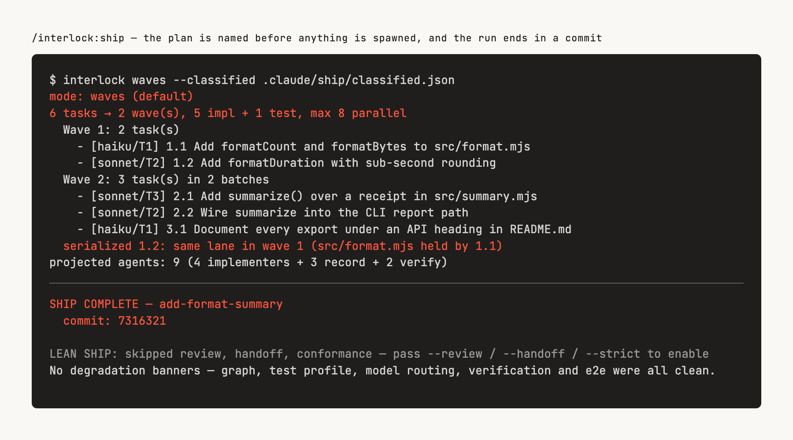

# Interlock

**Spec-driven development for Claude Code. You read one spec; parallel agents ship it to a tested commit.**

[](https://www.npmjs.com/package/@renzrollon/interlock)
[](https://github.com/renzrollon/interlock/actions/workflows/ci.yml)
[](docs/01-first-hour.md#before-you-start)
[](./LICENSE)

<picture>
  <source media="(prefers-color-scheme: dark)" srcset="docs/assets/hero-dark.png">
  
</picture>

```bash
/interlock:spec "<idea>"   # explores your repo, writes a reviewed spec, then stops
                           # ← you read it. The only place a human is required.
/interlock:ship            # parallel agents implement → your tests pass → commit. Nobody is asked.
```

- **One human checkpoint.** A spec is the cheapest place to catch a wrong idea, so that is the one place you must look. Everything after it is automatic.
- **Zero-touch by construction.** `ship` is a Claude Code workflow, and the workflow runtime has no channel for mid-run input. It cannot ask you anything, so it never does.
- **Caps and gates are code, not prose.** Parallelism, retry budgets and review thresholds are CLI exit codes a model cannot argue with, and during remediation an agent cannot even edit a test. Re-run any decision yourself, with no model and no network.

## Install

Interlock is a [Claude Code](https://claude.com/claude-code) plugin layered on [OpenSpec](https://github.com/Fission-AI/OpenSpec), which owns the spec format. It needs Claude Code **v2.1.154+** with dynamic workflows enabled, the `openspec` CLI, and Node.js ≥ 18. The full requirements table is in [the first hour](docs/01-first-hour.md#before-you-start).

```bash
npm install -g @fission-ai/openspec@latest   # OpenSpec first
cd your-project && openspec init
```

```bash
/plugin marketplace add renzrollon/interlock
/plugin install interlock@interlock
```

Then, once per repo. The plugin puts the `interlock` CLI on your `PATH`:

```bash
interlock doctor          # preflight: prints the exact allowlist an unattended run needs
/interlock:bootstrap      # reads the code, writes what it learned, builds the graph agents navigate
```

`doctor` exits 1 on anything that would stop a zero-touch run and prints the settings snippet that fixes it. The plugin runs it at every session start too. Your first shipped change, step by step: **[01 — The first hour](docs/01-first-hour.md)**.

## The flow

| | | |
|---|---|---|
| `/interlock:bootstrap` | Onboard a repo — once | skill |
| `/interlock:spec "<idea>"` | Idea → explored, reviewed, implementation-ready change. Asks you what the repo cannot answer, then stops | skill |
| **You read the spec** | The checkpoint. [Ten minutes, with a checklist](docs/02-the-checkpoint.md) | you |
| `/interlock:ship` | Reviewed change → waves (parallel batches of file-disjoint tasks) → your test suite → commit. No review by default; `--strict` adds adversarial review and handoff artifacts. `--solo` / `--waves` force the shape | **workflow** |
| `/interlock:mr` | Change → merge request | skill |

`ship` is the odd one out on purpose. A skill is instructions Claude follows; a workflow is a script a runtime executes, and this runtime has no channel for a question. That is why every decision that could need a human is settled *before* ship starts, and why `spec` is conversational where it has to be. The plan preview names the shape and the agent count before anything is spawned.

## Why this and not a folder of prompts

Decisions that have a correct answer are moved out of prose and into code, one at a time. The script holds the loop, the CLI holds the rules, the agents do the work.

- **Thresholds are code.** Wave order, the parallel-agent cap, the remediation round budget, the review quality band: each is an `interlock` subcommand with an exit code, not markdown a model can talk itself past. [Every subcommand →](docs/07-cli-and-configuration.md)
- **Parallel agents cannot overwrite each other.** The planner separates tasks that would touch the same file; with `--isolate-waves`, every parallel task runs in its own git worktree and a collision is a named halt, never a lost write.
- **Reviews you can actually read.** On `--strict`, up to six review dimensions run in parallel, then two skeptics attack every finding. A dismissal must cite a `file:line` in the diff or it dismisses nothing. You see only what survived, and how many did not. [How and why →](docs/06-why-it-works.md)
- **A guard, not a request.** During remediation an agent cannot edit a test, tick a task box, or commit outside the commit stage. They are `PreToolUse` hooks, inert outside a run. [The guards →](docs/13-the-guards.md)
- **Specs that don't quietly rot.** `interlock drift` reports unarchived changes, specs citing missing files, and code no spec describes. Each at its own confidence level, and it never blocks. [OpenSpec vs Interlock →](docs/03-openspec-vs-interlock.md)
- **Degradation is spoken, never silent.** A missing graph, an overridden model, a failed push, a host that cannot report tokens: each is a named banner in the summary. [When it stops →](docs/04-when-it-stops.md)

## How it compares

Most of the category competes on how much structure you write before coding — Spec Kit adds phases, BMAD adds roles, Kiro adds an IDE. Interlock competes on a different axis: **how many decisions the model is not allowed to make.**

It composes OpenSpec rather than replacing it. `openspec init` installs its own skills, and `/interlock:spec` drives the `openspec` CLI directly, so both stay available. Use `/interlock:spec` when you want the gates, and the stock skills when you want the plain artifact loop. What Interlock adds, and when plain OpenSpec is the right call: [03](docs/03-openspec-vs-interlock.md). Where it sits against OpenClaw, Hermes Agent and DeepSeek Harness: [08](docs/08-harness-landscape.md).

The trade is portability. Claude Code is the **default and supported host**; Cursor and Copilot are not supported. Everything the loop decides lives in a CLI any host can shell out to, so portability means a second host adapter, not thirty prompt templates.

## Beyond Claude Code (experimental)

`interlock-run` drives the same loop over the Claude Code CLI, any [Agent Client Protocol (ACP)](https://agentclientprotocol.com) agent, OpenAI Codex or Qwen Code. You start it yourself. No slash command does, and `/interlock:ship` never falls back to it.

Two things to know before you do. `claude -p`, the Agent SDK and ACP are the usage Anthropic flagged for separate metered credit; the interactive Workflow runtime that `/interlock:ship` uses is the exempted path, and the runner prints which path it is on. And Codex and Qwen do not understand the planner's model tiers, so map them per host with `INTERLOCK_MODEL_MAP`; an unmapped tier is bannered, never silently run on your default.

Host table, banners and configuration: [07](docs/07-cli-and-configuration.md#interlock-run--the-experimental-runner). The older `interlock-ship-acp` still works, prints a deprecation line, and is removed in the next minor. Code Mode is out of scope.

## The CLIs

Three zero-dependency Node binaries land on your `PATH`, and they work without the plugin too (`npm install -g @renzrollon/interlock`):

| | |
|---|---|
| `interlock` | The policy engine: `limits`, `gate`, `waves`, `verify`, `doctor`, `report` and the rest. Every gating command exits 1 when it blocks |
| `interlock-graph` | A local, deterministic code knowledge graph. No vector store, no network |
| `interlock-run` | The experimental runner above |

Everything runs without a model and without the network, with one exception. `interlock notify` and `run close --notify` push a message when a run halts or completes, and only when `INTERLOCK_NTFY_TOPIC` is set; `INTERLOCK_NTFY_URL` points it at a self-hosted server. Reference and every environment variable: [07 — CLI and configuration](docs/07-cli-and-configuration.md).

## Docs

New here? Start with **[01 — The first hour](docs/01-first-hour.md)**. Only ever prompted a coding agent? **[09](docs/09-from-prompt-to-workflow.md)** defines every term once, ending at why `ship` is a script and not a prompt.

| | |
|---|---|
| [01 — The first hour](docs/01-first-hour.md) | Install to first shipped change |
| [02 — The checkpoint](docs/02-the-checkpoint.md) | How to read a spec in ten minutes |
| [03 — OpenSpec vs Interlock](docs/03-openspec-vs-interlock.md) | What composes with what |
| [04 — When it stops](docs/04-when-it-stops.md) | Every halt and banner, and what to do |
| [05 — Continuity](docs/05-continuity.md) | When `--continue` may skip the human read |
| [06 — Why it works](docs/06-why-it-works.md) | The mechanisms, low-level, with the costs stated |
| [07 — CLI and configuration](docs/07-cli-and-configuration.md) | Every subcommand, environment variable and host |
| [08 — The harness landscape](docs/08-harness-landscape.md) | OpenClaw, Hermes Agent, DeepSeek Harness, and the spec-driven neighbours |
| [09 — From prompt to workflow](docs/09-from-prompt-to-workflow.md) | New to agentic workflows? Every term defined, then why `ship` is a script |
| [10 — Ship and spec for prompt-only engineers](docs/10-agentic-workflow-ship-and-spec.md) | Primer, review of spec+ship, token and quality tactics |
| [11 — The indicators](docs/11-the-indicators.md) | What `interlock report` measures and why it gates nothing; whether to commit the run corpora |
| [12 — Repository review policy](docs/12-repository-review-policy.md) | The optional `REVIEW.md`: what it can change and what it cannot |
| [13 — The guards](docs/13-the-guards.md) | The hooks, the stage marker's lifecycle, and the fail-open rule |
| [14 — Evals](docs/14-evals.md) | What a consumer's run is checked by, why no model evals run in your CI, how to file a failure |

## Development

```bash
git clone https://github.com/renzrollon/interlock && cd interlock
npm test                      # no dependencies to install first
claude --plugin-dir .         # load it without installing
```

More in [CONTRIBUTING.md](./CONTRIBUTING.md). Built on [OpenSpec](https://github.com/Fission-AI/OpenSpec) by Fission AI, and on the wave-execution pattern for parallel task application. [MIT](./LICENSE).
