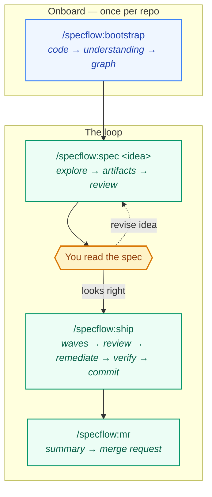

# SpecFlow

**Autonomous spec-driven development for Claude Code, layered on [OpenSpec](https://github.com/Fission-AI/OpenSpec).**

Three commands, one human checkpoint. Onboard a repo, produce a reviewed spec, then ship it start-to-commit with parallel agents — while the decisions a computer can make correctly stay in code, not in prose.

```bash
/plugin marketplace add renzrollon/specflow
/plugin install specflow@specflow
```

Requires [Claude Code](https://claude.com/claude-code), the [`openspec`](https://github.com/Fission-AI/OpenSpec) CLI, and Node.js ≥ 18.

---

## The flow

One human stop. Everything else is automatic.



**The gap between `spec` and `ship` is the product.** A spec is the cheapest place to catch a wrong idea, so that is the one place a person looks. Everything on either side of that line runs without asking you anything.

`/specflow:ship` means it: `AskUserQuestion` is removed from its tool pool for the whole run. The zero-touch contract is enforced by the harness, not by the model's good intentions.

---

## Why this and not a folder of prompts

Anything a computer can decide correctly is decided by a computer. The plugin ships two CLIs on your `PATH`:

**`specflow`** — the deterministic spine. Each subcommand replaces a judgement the model used to re-derive in prose on every run, usually inconsistently:

| Command | Decides |
|---|---|
| `specflow waves` | Wave order, per-task model, and a **hard cap on parallel agents** |
| `specflow surface` | Whether a diff touches UI, and therefore needs a manual test plan |
| `specflow gate` | Whether a review blocks, and how findings partition for parallel fixers |
| `specflow validate` | Whether a change is actually implementable |
| `specflow autonomy` | The L2→L3 earned-autonomy ladder |

```bash
$ specflow surface --changed src/Button.tsx docs/readme.md app/api/login/route.ts
UI-TESTABLE      src/Button.tsx           (.tsx component)
NOT-UI-TESTABLE  docs/readme.md           (docs file)
UI-INDIRECT      app/api/login/route.ts   (API route path)

needsManualTestPlan=true needsDevopsReview=true
```

**`specflow-graph`** — a local, deterministic code knowledge graph. No vector store, no network. Agents navigate with token-budgeted subgraphs instead of re-grepping:

```bash
specflow-graph build .
specflow-graph consumers normalizeEmail
specflow-graph path lib/auth app/api
```

Everything genuinely requiring judgement — classification, implementation, review, synthesis — stays with the model. The split is the point.

---

## Reviews you can actually read

`/specflow:review-code` fans out six dimensions in parallel, then **puts two skeptics on every blocker and warning and tries to refute it.** Findings that don't survive are never shown to you.

An unverified review reports everything it notices, so you learn to skim it. A review where every finding survived two adversaries is one you read line by line. The report always tells you how many findings were dismissed — that number is the evidence it's worth trusting.

---

## Earned autonomy

Every gated path starts at **L2** (human in the loop) and reaches **L3** only after three consecutive clean runs. A blocker or a human override resets it.

```
review-artifacts blocker → also resets  explore + spec
review-code      blocker → also resets  ship
```

Transitive blame is what stops a path gaming the ladder: `spec` can't earn autonomy by emitting shallow specs, because the downstream gate blames whoever produced the bad artifact.

Autonomy changes *whether the flow waits for you* — never *whether the quality gates run*. A blocker is a hard stop at every level.

> The ladder ships as opt-in. It's well tested, but it has not yet accumulated real-world run data, and a feature that gates your workflow should earn its own trust first.

---

## Skills

| | |
|---|---|
| **Onboarding** | `graph` · `docs-digest` · `bootstrap` |
| **Loop** | `explore` · `spec` · `ship` · `mr` |
| **Called by those** | `review-code` · `review-artifacts` · `manual-test-plan` · `explain-code` · `commit` · `fix-tests` · `dispatch` |

Not sure where you are? `/specflow:dispatch` runs one batched pre-flight and routes.

---

## It composes OpenSpec — it doesn't replace it

`openspec init` installs its own `openspec-propose`, `openspec-explore` and `openspec-apply-change` skills. SpecFlow does **not** fork them. `/specflow:spec` drives the `openspec` CLI directly — `openspec new change`, `openspec status --json`, `openspec instructions` — because the CLI is the stable contract and a forked skill drifts on every OpenSpec release.

What SpecFlow adds around it: parallel exploration with a durable brief, an evidence gate for bug fixes, invariant sweeps, adversarial review, wave execution, and the deterministic spine above.

Both sets of skills coexist. Plugin skills are namespaced, so `/openspec-propose` and `/specflow:spec` both stay available. Use `/specflow:spec` when you want the gates; use the stock skills when you want the plain artifact loop.

---

## Language support

Structural graph indexing — import and symbol edges — covers **JavaScript/TypeScript, Python, and shell**. Other languages (Go, Rust, Java, Ruby) get everything else: docs and OpenSpec indexing, spec→file links, prose retrieval, and the full workflow. When `specflow-graph build` finds nothing to index it says so and explains why, rather than reporting an empty graph as success.

Docs discovery adapts to your layout: it probes `docs/`, `doc/`, `documentation/`, `site/`, `guides/` and `wiki/`, and always includes root-level `README.md`, `ARCHITECTURE.md` and `CONTRIBUTING.md` — which on many projects are the only documentation there is.

Everything else in the plugin is stack-agnostic. `bootstrap` reads your dependency manifest and phrases its explorer agents in your stack's vocabulary.

---

## Development

```bash
git clone https://github.com/renzrollon/specflow && cd specflow
npm test                      # 171 tests, no dependencies
claude plugin validate . --strict
claude --plugin-dir .         # load it without installing
```

`/reload-plugins` picks up edits without restarting.

---

## Credits

Built on [OpenSpec](https://github.com/Fission-AI/OpenSpec) by Fission AI, and on the wave-execution pattern for parallel task application.

[MIT](./LICENSE)
