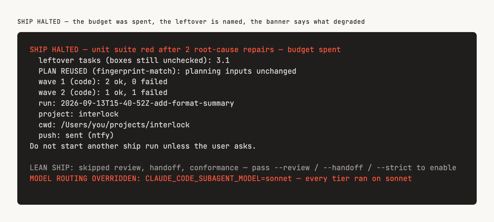

# When it stops

This page tells you how to read a Interlock run that halted, or that finished with a warning banner you did not expect.

There are two categories, and they are not the same thing.

**Loud halt** — the run stops, nothing is committed, and it reports what completed and what you need to decide. Something was genuinely undecidable or unsafe.

**Soft continue** — the run keeps going with a documented default, and prints a banner in the final summary saying what it degraded. The work is done, but a capability was missing or a check did not run. These are the lines people skim past; they are the ones worth reading.

Almost everything is a soft continue. The halts are deliberately few.

## Before it stops: the preflight

A third category is not really a halt at all — it is a condition that was true before the run started and only became visible in the middle of it. An unallowlisted `npm test` that parks the run on an approval prompt with nobody watching. A `.claude/ship/` nothing can write to, which since the reconstructability gate ends the run rather than degrading it. A missing `openspec` CLI. A plugin that installed without its agent definitions, so the first lane cannot spawn.

None of those are judgement calls, and none of them need a run to discover:

```bash
interlock doctor
```

It checks the Node version against both floors that apply (Interlock's, and the OpenSpec CLI's higher one), the installed plugin's workflow and agent types, `interlock` / `interlock-graph` / `openspec` / `git` on PATH, whether this project is an OpenSpec project and a git work tree, `.claude/testing/profile.json`, the permission allowlist, and whether every run-state directory can be written — each one where it lives, so from a linked worktree the trajectory directory is probed in the main checkout ([`CORPORA IN MAIN CHECKOUT`](#corpora-in-main-checkout-and-corpora-in-state-home)).

Two things about the allowlist check are worth knowing, because they are where a preflight normally lies to you. It derives the commands it requires rather than hardcoding them — the four the flow always shells out to, plus whatever your own test profile says this project runs — so a repo whose suite is `pnpm vitest run` is checked for `pnpm vitest run`. And a rule that exists but is *narrower* than the command it would have to permit (`Bash(interlock waves:*)` where the loop calls thirty subcommands) is reported as narrower, never counted as coverage.

It exits 1 when something would stop an unattended run, prints the settings snippet that fixes it, and changes nothing itself.

The plugin also runs it for you at every session start, through its `SessionStart` preflight hook, and folds the verdict into the session's context: one `interlock preflight OK` line, or the failing checks with their fixes. On a host that loads the ship meter (Claude Code 2.1.287 and later, in a terminal or the Desktop Code tab) you see it too: when a check failed or warned, the preflight could not run, an interrupted run was spoken, or a halt resume card is waiting, a band above the prompt shows those lines in the doctor's and the hook's own words, with a **Hide** control, and `/interlock-preflight` opens the whole report with every check's fix. The band appears at your first prompt of the session, because the engine raises nothing a hooks module sees between the hook's write and that prompt. The report behind both is `.claude/ship/preflight.json`, which the hook writes only in an OpenSpec project; an all-ok preflight draws nothing ([the guards page](./13-the-guards.md#the-ship-meter)).

## The loud halts

`/interlock:ship` has three hard halts on the default (lean) path, plus two preconditions that stop it before it starts. `--review` / `--strict` adds a fourth halt: unresolved review blockers.

| Condition | What it means | What to do |
|---|---|---|
| `interlock validate` exits non-zero | The change is not implementable: an artifact is missing or empty, or `tasks.md` has no real checkbox tasks | Run `interlock validate <change-name>` yourself and read the reason. Usually the change was never fully specced — go back to [the checkpoint](./02-the-checkpoint.md) or re-run `/interlock:spec`. |
| Subagents unavailable | `ship` orchestrates and never implements inline — context isolation is the entire point, so it stops rather than falling back | Usually your own permission settings restrict the `Agent` tool. Allow it and re-run. Do not work around it by asking the model to implement in the main conversation. |
| Unresolved blockers after two remediation rounds | `--review` / `--strict` only. The diff review found problems the fixers could not close in two passes | Read the surviving findings. Two failed rounds usually means the design was wrong, not the code — consider re-speccing rather than a third round. A lean run never reaches this halt. |
| Unit suite still red | Repair by root cause was capped and the suite did not go green | Fix it yourself, or run `/interlock:fix-tests`. Note what `ship` did **not** do: it will not weaken a test, loosen an assertion, or narrow the suite to get green. |
| More than two task failures across waves | Enough tasks failed that the remaining plan is not trustworthy | Read which tasks failed. Repeated failures in one area usually mean `tasks.md` was underspecified there. |
| A trajectory line could not be written mid-run | A `run` step tried to append to `.claude/ship/runs/<runId>.jsonl` and the write did not land, so it halts **before** ticking any task and before the commit. The reason reads `trajectory append failed: <site>: <cause>`, where the site is the step that owed the line — `run-start`, `wave-state create`, `wave-state record-batch`, `wave-state record-verify`, `wave-state replan`, `agent-spawn`, `agent-result` or `cli-exit`. | Read the cause in the halt reason; it is the filesystem's own, usually a full disk or a `.claude/ship/runs` nothing can write to. Fix that and re-run. Nothing was ticked and nothing was committed, so the re-run starts from a truthful `tasks.md`. This is new: the live run path used to warn and continue, which produced exactly the artifact the trajectory exists to prevent — a run that ticked boxes, committed, and cannot be replayed. |
| Ship-run trajectory is not reconstructable | The `record-outcome` ping ran `interlock run-log check --state` and it exited non-zero — a sequence gap, a missing `run-start`, or a `wave-state`/`verify judge` invocation with no logged `cli-exit`. An otherwise-clean run still halts on this, because an unreconstructable run defeats the reason this file exists. | Read the reported problems with `interlock run-log check --run-id <id>` yourself. Usually a write to `.claude/ship/` failed mid-run (disk full, permissions) — fix that and re-run, and run `interlock doctor` first next time, which probes exactly that. This is new: until this halt existed, the writer degraded silently on a failed append. |

On any halt: nothing is committed, and it will not ask you a question. `ship` is a dynamic workflow, and the workflow runtime accepts no mid-run user input at all — there is no one listening, by construction rather than by policy. The report is the whole interface.

Every one of those halts is a non-zero exit from a `interlock` subcommand rather than a judgement call: `validate` when the change is not implementable, `remediate` when blockers survive the verdict round, `verify unit` when the suite is red or was weakened, `wave-state record-*` when a recorded result halts the run. The workflow branches on the exit status, so a halt is not something the model can decide it has earned its way past.

### Reading a `SHIP HALTED` run

The final summary tells you *that* a run halted and why in one sentence. Every terminal summary also carries a `run: <runId>` row, a `project: <slug>` row and a `cwd: <absolute path>` row — the run id is the join key: it is the exact filename of the trajectory below, `<slug>` is a pure function of the directory the close ran in (every character outside `[A-Za-z0-9]` becomes `-`), which is the host's project directory under `~/.claude/projects` only when the session started there, and `cwd` is that directory itself. Use them to find the right trajectory file when more than one run is on disk, before falling back to `run-log list`. When a run halted before any plan was adopted there is no run id yet, and the row says so instead of printing an empty value: `run: none — the run halted before a plan was adopted`. A run in a linked worktree adds a `state home: <path>` row directly under `cwd:`, and only then: its trajectory, outcome line and resume card are in the main checkout that row names, not in the worktree ([`CORPORA IN MAIN CHECKOUT`](#corpora-in-main-checkout-and-corpora-in-state-home)).

<p align="center">
  
</p>

A halt also leaves one file behind, because the terminal that printed the summary is usually gone by the time anyone reads it. `interlock run close` writes a **halt resume card** to `.claude/handoff/ship-<change>-<runId>.md` — repo-relative, and gitignored — and names it in the summary as a `resume card:` row, immediately above the `Do not start another ship run unless the user asks.` line. It is the first thing to open; the trajectory below is still where the full walk lives. The card restates the halt reason, then says where the run stopped: change, run id, project slug, `cwd`, the trajectory path and the two `run-log` commands below. It lists the task ids still unticked alongside `interlock tasks tick <change> --ids <…>` — with a placeholder, deliberately, not those ids: a halt leaves both done-but-unmarked work and work never attempted, `tasks tick` verifies nothing, and ticking the second kind is how unimplemented work ships behind a `[x]`. It reports this run's own `PLAN REUSED` / `PLAN REBUILT` verdict and whether a plan and a fingerprint are on disk naming this change, how far the waves got, every lane whose host recorded a session (on `interlock-run --host claude`, with `claude --resume <id> --fork-session` and the reasons that session may be gone), and every degradation banner raised before the halt. Every list in it is capped — the cap is published by `interlock limits` — and the card says how many rows it left out and which command prints the whole list, rather than truncating into silence. When the run halted before a plan was adopted there is no run id, and the file is `ship-<change>-no-run-id.md`. Only a halt writes one: a clean close has nothing to resume, and its summary already ends in `ARCHIVE PENDING`.

**Nothing reads the card back to decide.** It is a record, not a trigger, and it says so in its own opening lines, because a markdown file called a resume card is exactly the artifact a reader assumes is wired into something. The next `/interlock:ship` still decides whether to skip the wave classifier from the stored plan fingerprint alone, so a card that was never written — or one you edited by hand — cannot change what a later run does, and dispatch does not route off it either. That is why the plan section reports what *this* run did and then states the rule, rather than predicting the next verdict: a fingerprint recomputed at the next `run start` decides, ticking a checkbox does not break it, editing an artifact or adding, removing, reordering or rewording a task does, and so does passing a different `--solo` / `--waves` / `--tdd` shape.

Two things show it, and neither acts on it. The next session's preflight lists the cards of changes still open under `openspec/changes/`, from the stamp on each card's first line, and on a host that loads the ship meter the band above the prompt names each one with `/interlock-handoff`, which renders the card in a pane exactly as written. A card longer than `handoff pane chars` from `interlock limits` is cut there with a line saying how much was left out; the whole card is still at its path. Nothing marks, moves or deletes a card for having been shown.

It is also not a mid-run resume. The wave cursor and the previous wave's handoff packets are not restored — `.claude/ship/state.json` is replaced at wave 0 by the next run — so work that was written but never ticked can be dispatched a second time. That is why ticking first is the step the card does not treat as optional.

To see the whole walk that led there — every wave-state action, every agent the loop spawned, every verify judgement — read the run's trajectory instead of re-deriving it from git history or from the summary alone:

```bash
interlock run-log list                       # every recorded run: change, halted?, event/skip counts
interlock run-log show <runId>                # one run's events, in sequence order
interlock run-log query --run <runId> --halted   # only the events that explain the halt
interlock run-log query --run <runId> --type verify-judgement   # e.g. just the verify verdicts
```

The trajectory lives at `.claude/ship/runs/<runId>.jsonl` in the state home — an append-only JSON Lines file, one line per wave-state action, CLI exit, agent spawn, agent result (what the host reported about an agent after it returned), and verify judgement. `list` prints every run's id, so if you do not have the run id handy, start there. `run-log show`/`query` never fail on a torn or unreadable line — they skip it and say so, the same way `outcomes list` does, so a crash mid-append costs you at most that one record, not the read.

A `verify-judgement` line never carries the raw suite log — a red unit suite's full stdout lives under `.claude/ship/spill/<runId>/`, and the trajectory line points at it with a locator and a short preview instead. If a judgement's preview does not tell you enough, open the locator with `offset`/`limit` rather than reading the whole file — it can be hundreds of KB.

### `RELAY UNREADABLE`

This halt is about the transport, not your change. On the `/interlock:ship` workflow host, every `interlock run` call is made by a relay: a small model runs the command and copies its stdout back into the script. When that copy does not parse, the script cannot see the step the CLI emitted, and it halts rather than guess. The reason reads `the run program returned no step — the CLI relay could not be read: <label> (interlock run <sub>): <why>`, and the banner repeats it. `<why>` says whether the relay returned nothing, returned no stdout, or returned a copy of N characters that did not parse, and gives the parser's own message, which usually includes the failing position.

The CLI's own bytes are always on disk. Every `run` call except the close writes exactly what it printed to `.claude/ship/last-step.json` (the close that records the halt would otherwise overwrite it), so you can compare that file with the relay's length without digging the relay out of a transcript. The run state is intact: the failed copy happened after the CLI had already recorded the batch. So do not replay the last call by hand; a repeated `record-batch` would record the batch twice. Re-run `/interlock:ship` once the cause is clear.

This was far likelier before the workflow host's steps were slimmed. A step used to carry every briefing inline, plus the wave's carried state, and a relay retyping 23 KB of JSON dropped two brackets. The relay now copies only the fields the script reads (`relayStep` in `lib/run.mjs`), and briefings travel by path and hash.

### `LANE BASE MISMATCH`

Only under `--isolate-waves`. Every lane of an isolated batch must fork from the batch's merge base: a snapshot of the shared tree taken just before the batch was dispatched, holding every earlier fold of the run. Before anything folds, `interlock run record-batch` asks git which commit each lane's worktree is checked out at, and halts when one is not that snapshot. The reason reads `LANE BASE MISMATCH: <lane> forked from <sha>, expected <snapshot>` — `(unreadable)` in the sha slot when git could not answer for a lane that reported writes — and names every surviving worktree, the way the collision halt does.

Nothing from that batch was folded, not even a lane that did fork from the right base. That is the point of the halt. A lane forked from anything else reports the difference between the two commits as its own write, and the whole-file fold would quietly put back whatever that difference held — an earlier batch's edit, reverted, with exit `0`. A lane that reported no writes and whose worktree is gone is an empty-write lane, not a mismatch.

On a runner host this means something forked the lane from a commit the step did not name: read the worktree with `git -C <path> log -1` and compare it to the step's `mergeBase`. On the Workflow host it is expected for now, and the reason says so: the runtime forks lane worktrees from `worktree.baseRef`, which a plugin can neither read nor set. `run start` warns about it up front as `ISOLATION BASE NOT CONTROLLED (workflow)`. The first isolated batch of a run started on a clean tree can still pass — with `worktree.baseRef: head` its lanes fork from HEAD, which is then the snapshot — but a batch after the first fold halts here until a follow-up change creates lane worktrees from the CLI. Drop `--isolate-waves` on that host until then.

### `/interlock:spec` stops too

**Blockers at the artifact review.** It reports them and stops rather than fixing and continuing, because a blocker there means the spec was wrong and you should see that.

**Continuity paused.** Only on a run you started with `--continue`. The readiness gate exited non-zero, so `spec` did not invoke `ship`. You get a short list — the decisions still marked as needing a person, and the named blockers — and nothing else; you opted out of reading the spec, so it does not hand the spec back.

Answer the questions and it writes them into the ledger, re-runs the gate, and continues if it now passes. To see the same verdict yourself:

```bash
interlock ready <change-name> --review <review-result.json> --paths <planned paths>
interlock ledger <change-name>       # non-zero while a decision still needs a person
interlock risk <change-name> --paths <planned paths>
```

`ready` fails closed: a check that could not run is a blocker, not a pass. If the answer is that the blast radius is too wide, that is not something to answer your way out of — read the spec and run `ship` yourself. [**05 — Continuity**](./05-continuity.md) explains what each check means.

## When the run never starts, or stalls

Two failure shapes that are about your environment rather than your change, and neither reads like the halts above.

**`/interlock:ship` is unknown, or the trampoline halts.** `/interlock:ship` is a skill that launches `workflows/ship.js` on the Workflow runtime. The Skill tool will find the command in any repo where the plugin is installed. What still has to be true for the *run* to start: Claude Code **v2.1.154+** with dynamic workflows enabled. Where they are off — `disableWorkflows`, an org policy, `CLAUDE_CODE_DISABLE_WORKFLOWS`, a Pro plan that has not turned them on in `/config`, or an IDE that never exposes the Workflow tool — the trampoline **halts rather than implementing the loop in conversation.** Everything else in Interlock still works, including `spec`, the reviews and `commit`, so you can implement the change another way, but the loop this tool is built around needs the workflow runtime.

That halt is unchanged by the existence of a second host. There is an experimental **runner** that runs the same loop off the workflow runtime, over the vendor coding CLI you name — but it is **a separate path you invoke yourself, not a fallback.** The trampoline will never reach for it, and the runner refuses `--host workflow` from the other side: an automatic downgrade from "the runtime guarantees nobody can interrupt this" to "some other agent is driving it" is exactly the quiet degradation this file exists to make impossible. If you want it, run it deliberately:

```bash
interlock-run <change-name> --host claude          # the installed Claude Code CLI, headless
interlock-run <change-name> --host codex           # OpenAI Codex
interlock-run <change-name> --host qwen            # Qwen Code
INTERLOCK_ACP_COMMAND="<agent>" interlock-run <change-name> --host acp
```

**There is a reason the default did not move.** Inside an interactive session, the Workflow runtime is the path Anthropic exempted from its paused programmatic-use billing change. `claude -p`, the Agent SDK and ACP are the usage that change flagged for a separate metered pool. So `/interlock:ship` stays the supported path, no skill ever starts the runner, and the runner says out loud which billing path it is on — see `SUBSCRIPTION PATH` below. If that policy settles differently, this paragraph is the one place to update.

It runs the whole loop, `--strict` and its pieces included: adversarial review, bounded remediation, the verdict and the handoff artifacts are steps `interlock run` emits, and this driver interprets them the way it interprets a wave. Every judgement with a correct answer — what a finding survives to, how many rounds the budget allows, which dimensions run — stays in the CLI, so a strict run here halts on the same terms as one on Claude Code. Under `--isolate-waves` the runner also creates one git worktree per lane from the batch's merge base — a snapshot of the shared tree, so a later batch starts from every earlier fold — and folds them back through the same `record-batch` that halts on a real collision and on a lane that did not fork from that snapshot ([`LANE BASE MISMATCH`](#lane-base-mismatch)), so lane isolation is not a Claude-Code-only guarantee any more.

Exit `0` is a terminal summary and `1` is a halt — or a run that finished and committed but could not write its own record. That third case is real and deliberate: when the close cannot append its `run-receipt` or terminal line, the summary still reads `SHIP COMPLETE`, because the run did complete, and the exit code still moves to `1`, because the run cannot be replayed. The [`TRAJECTORY APPEND FAILED`](#trajectory-append-failed) banner names which line was lost. Do not read a `1` as "the change was not shipped" without reading the banner block — check the commit. Exit `2` means the invocation could not be started at all — an unknown `--host`, the Workflow host id, or a host command that is missing or unusable — and nothing is written for a run that never happened: no manifest, no briefing, no trajectory event. Its banners are in [the soft continues](#runner-host-id-experimental-and-the-rest-of-the-runners-banners) below, and the README's Experimental section says what it is for.

`interlock-ship-acp <change>` still works: it prints a deprecation line on stderr and runs `interlock-run --host acp` with your arguments. It is removed in the next minor version.

**The run stops halfway and waits for you.** Workflow agents inherit your own permission settings, so a command that is not allowlisted raises an approval prompt mid-run — which is exactly what a zero-touch run should never do, and the one interruption the runtime cannot prevent, since it is your setting being honoured. Run `interlock doctor` before a long run — it prints the derived `requiredCommands` list and the exact allow rules to add, rather than a fixed list this page would have to keep in sync. If you find a run sitting on a prompt, approve it and allowlist that command so the next run does not. The close counts the prompts a run met, so one you did not see happen is still named afterwards: [`PERMISSION PROMPTS DURING RUN`](#permission-prompts-during-run-and-auto-mode-denied-n-tool-calls).

### Two different caches, and only one of them is on this page

This page has always used the word "cache" for one thing. There are two, they are unrelated, and prose about one currently reads as advice about the other.

| | **Workflow replay cache** | **Anthropic prompt cache** |
|---|---|---|
| Keyed on | an agent's exact prompt and its options (label, model, schema and the rest), in the order agents started | the leading prefix of a request |
| What it does | a resumed run skips agents that already finished | a repeated prefix is re-read instead of re-sent |
| Expires | when the session ends, or an agent's prompt or options change | on idleness, after a lifetime you configure |
| You control it by | not editing prompts or labels mid-run | two settings keys, below |

Everything else in this section — resume, replay order, the cache-busting warning below — is the **replay** cache. Nothing on this page about it says anything about the prompt cache.

**The prompt cache is the one that costs money between waves.** A request's stable prefix is written to cache once and read back cheaply while the entry lives; once it expires, the next request re-writes it cold. Wave boundaries in a ship run routinely outlive the short default, so a run can re-pay for the same ~30–40k-token spawn prefix wave after wave without anything saying so.

The host splits requests into **two buckets with two independent lifetimes**, and setting one leaves the other on its default:

| Setting | Governs | Matters because |
|---|---|---|
| `promptCacheTtl` | your main conversation | the CLI's main conversation runs on the short default |
| `subagentPromptCacheTtl` | subagents and workflows | **this is the one that governs a ship run's wave agents** |

Both are ordinary settings keys, valid in any of the four scopes Claude Code merges, and **both require Claude Code v2.1.242 or newer** — below that they are accepted and silently ignored, with no error and no effect.

**Interlock cannot set either one.** A plugin's component model is skills, agents, hooks, MCP servers, LSP servers, monitors, commands and workflows; there is no settings component and no session-env component. So `interlock doctor` carries a `prompt-cache` row that reports whether each key is configured, in which scopes, and which authentication mode was detected — advice only, `ok` or `skip`, never a failing check, because an unset lifetime costs money and never costs correctness. The row reports **configuration only**: nothing exposes to a hook or a command the lifetime a session is actually running under, so it never claims one.

What a run records: cache-read and cache-creation tokens, per wave and for the run, split by lifetime tier. A runner host reads them off the vendor CLI's own usage envelope. The Workflow runtime exposes one cumulative spend scalar and no breakdown, so on `/interlock:ship` they come from somewhere else: the plugin's `SubagentStop` hook sums each agent's own transcript into a small file, and `run close` joins those files to the spawns it dispatched. A **complete** join — every briefed spawn matched a file with usage — records the figures, and the receipt's host block records the run's cache accounting as `hook`, observed rather than declared. A **partial** join records the waves it completed, leaves every other wave and the run total unknown, and says how many agents went unrecorded: [`CACHE ACCOUNTING PARTIAL`](#cache-accounting-partial-agent-usage-unjoined-and-agent-usage-unreadable). A run where no agent was recorded with usage at all — hooks disabled, or a host that never fired them — records the figures as **absent, never zero**, and says so in the summary as `CACHE ACCOUNTING NOT REPORTED`.

**You stopped the run, and resuming re-ran more than you expected.** Resume from `/workflows` keeps completed agents' results, but two rules decide which ones survive, and the second one surprises people:

- An agent still running when you stopped is not saved, so it starts over.
- Replay follows the order agents *started*. Caching stops at the first agent that did not finish, and **every agent that started after it re-runs — even the ones that completed.**

So stopping mid-wave costs the whole rest of that wave. This is one place Interlock's shape pays off: a run fanned out across many small agents preserves far more progress across a pause than one long agent would, because there is less work sitting behind the first unfinished agent.

**Do not edit a control-plane prompt to "cache-bust" a bad `action`.** The Workflow cache keys on an agent's exact prompt and its options, the label among them. Changing `next-1`, a shared step suffix, or any earlier agent to force a live re-run of a ping that returned `action: "report"` (or any other invented value) makes that step a cache miss — and **every agent that started after it re-runs**, including implementers whose work is already on disk. `ship` retries an unknown action once itself by re-asking `wave-state next` under a new `next-retry-*` label. That misses cache for the ping only. If a live run on older code already cached a garbage action, change **only** that step's label (for example `record-batch-12` → `record-batch-12b`), never an earlier prompt.

**Upgrading Interlock does not rename the lanes a resume replays.** A lane's label in `/workflows` is the title its step carried, and a step reaches the script only as its relay's stdout. On a resume the completed relays hand back their saved stdout, so every lane the run had already dispatched is spawned under the title it first ran under, and its saved result comes back. Only the steps the upgraded CLI prints after the resume carry its new titles, and those lanes are new work anyway.

Resume also only works **within the same Claude Code session**. If you exit Claude Code while `ship` is running, the next session starts it fresh — no cached results, no partial credit. On a long run, leave the session open.

**A `Large workflow` warning appears in the task panel.** Claude Code flags a run scheduling more than 25 agents or projecting more than 1.5M tokens (v2.1.203+). A **`--strict`** run crosses that easily — several waves of up to 8 implementers, four to six review dimensions, two skeptics per blocker and warning, then one fixer per file. Default (lean) ship is implementers plus verify plus commit, and usually stays under the warning. **The warning is advisory: it does not pause, cap, or halt the run.** It is pointing you at `/workflows` in case the size is a surprise. If it is not, ignore it.

The related `workflowSizeGuideline` setting (`/config`, default `medium`) is advice Claude follows when it *writes* a workflow. `ship` ships as a pre-written script, so the guideline should not throttle it — but that is read from how the setting is documented rather than measured, so if you see wave sizes that disagree with `interlock limits`, that would be the first thing to check.

## Retrigger and `/goal`

There are three loops. Mixing them up is how leftover checkboxes burn a second 20+ agent `Workflow()` call.

**Inner retries stay inside one `ship.js` run.** They are already capped (`interlock limits`): a one-shot `next-retry-*` when `wave-state` stdout is not a real action, inter-wave verify fix attempts, replan of unexecuted groups, remediation rounds 1–2 (round 3 is verdict-only), unit root-cause repair, and mechanical `interlock tasks tick` after a successful batch. Do not promote any of those to a second `Workflow()`.

**Start a new outer run only when:**

| Trigger | Why it is valid | Who says so |
|---|---|---|
| New user message `/interlock:ship` (or "ship leftover tasks") | New intent | Human |
| After **SHIP HALTED**, you fix the cause (artifacts, allowlist, re-spec) then ship | A fail-closed gate can now pass | Human + CLI |
| `spec --continue`: you answer the ledger, `interlock ready` exits 0, ship launches **once** | Continuity's one legal bridge | Human answers + `interlock ready` |
| Resume the **same** workflow from `/workflows` after an interrupt | Cache replay, not a new plan | Human |

**Never auto-retrigger.** Leftover `- [ ]` after `SHIP COMPLETE WITH LEFTOVERS` is a report (failed tasks under the halt cap). Unticked-but-done work is `interlock tasks tick`, not a second implementer pass. A classifier drop is a halt via `interlock tasks coverage`. Dispatch must not route "unchecked tasks → ship" after a workflow just returned. A halt resume card sitting under `.claude/handoff/` is not a trigger either: it is a record of a run that already stopped, nothing reads it, and it repeats this rule in its own text. Finding one licenses no ship — the halt row of the table above does, after you fix the cause and a person asks. The `Large workflow` warning is advisory. Failed leftovers are retried only by a new human ship — preferably `--apply-only` so review and commit are not paid twice.

Claude Code's [`/goal`](https://code.claude.com/docs/en/goal) is a *session* Stop hook: a transcript evaluator that starts a new parent turn when the condition is unmet. It does not run commands or read files. Interlock does not invoke `/goal`, and it does not ship a plugin Stop hook that blocks until boxes are empty — that re-creates the token leak and fights the eight-block cap.

`finish()` and the spec checkpoint print a greppable line so a user-set `/goal` can stop:

```text
GOAL MET: interlock ship returned a terminal summary.
GOAL MET: interlock spec stopped at the checkpoint.
```

Leftovers and a halt still print the ship line. They are terminal summaries, not a missing second ship.

**Safe** (the evaluator can yes on the transcript):

```text
/goal The transcript contains "GOAL MET: interlock ship" or "GOAL MET: interlock spec". Leftover checkboxes and a second Workflow call are not required.
```

**Unsafe** (do not use — leftover boxes, a red e2e banner, or "keep going" will start another turn): `all tasks.md boxes checked`, `tests pass`, `keep implementing until done`.

## The skip receipt

### `LEAN SHIP`

Default `ship` skipped one or more of review, handoff, and conformance. This is not a degradation — it is the advertised default. The line lists what was skipped so a lean run cannot look like `--strict`.

```text
LEAN SHIP: skipped review, handoff, conformance — pass --review / --handoff / --strict to enable
```

`--strict` (or all three flags together) omits this line. Continuity (`spec --continue`) also launches lean unless you pass a tail flag.

### `ARCHIVE PENDING`

Printed on a clean completion — no halt, and no leftover tasks — immediately before `Do not start another ship run unless the user asks.`:

```text
ARCHIVE PENDING — <change>: after merge, run openspec archive <change>
```

Archiving happens after the change merges, not before, so the run cannot do it for you and does not try — this line is a reminder, never an action, and it never changes the exit code. When other completed changes under the planning directory are also sitting there unarchived, a second line follows: `also unarchived: <n> completed change(s) — run interlock drift`. Neither line prints on a halt or on a run that finished with unticked tasks, because in both cases the change is not actually complete.

## The soft continues

Every soft continue below is printed in the summary of `interlock run close`, as it always was, and that summary is the record. On a host that loads the plugin's hooks module (Claude Code 2.1.287+, an interactive terminal or the Desktop Code tab), each banner also appears **live** as a toast the moment the step that raised it is printed, and the [ship meter](./07-cli-and-configuration.md#the-ship-meter-interlock-meter) (`/interlock-meter`) lists every banner so far. The meter shows what the CLI named; it adds no banner of its own and changes nothing about the close.

### `GRAPH UNAVAILABLE` and `GRAPH FROM MAIN CHECKOUT`

The code knowledge graph is not usable. `/interlock:bootstrap` reports it when the build errors or indexes nothing. A ship run reports it from `interlock run start`, on either host, when neither the working root nor the [state home](#corpora-in-main-checkout-and-corpora-in-state-home) has a `.claude/graph/graph.json`:

```
GRAPH UNAVAILABLE: never built — implementer and reviewer agents fall back to grep and will be slower
```

The Workflow driver used to decide this itself, from a `test -f` in its validate ping. It no longer looks: the CLI is the one party that checks, because two probes of one file in two places is how a driver and the CLI come to disagree about whether it exists. Either way the agents fall back to grepping — slower and more token-hungry, but correct.

If the reason is `never built`, the fix is to run `/interlock:bootstrap` once.

The most common cause is language coverage. **Structural indexing — import and symbol edges — covers JavaScript/TypeScript, Python, and shell only.** A Go, Rust, Java, or Ruby repo will produce little or no structural graph, and that is expected. Those projects still get docs and OpenSpec indexing, spec-to-file links, prose retrieval, and the complete workflow. Nothing in the loop requires the graph.

If your repo *is* JS/TS, Python, or shell and the graph is still empty, build it directly and read the error:

```bash
interlock-graph build .
interlock-graph report .
```

`GRAPH FROM MAIN CHECKOUT` is the milder case, and only a run in a linked worktree raises it. `.claude/graph/` is gitignored, so a fresh worktree has no graph; `run start` looks in the working root first, finds the main checkout's, records that path on the run manifest and says so:

```
GRAPH FROM MAIN CHECKOUT: <path> — it may be stale for this worktree; a lane without a graph falls back to grep
```

That graph was built from the main checkout's files, before this worktree's edits, so a query can still name a symbol this branch renamed or miss one it added. Nothing is copied into the worktree. `interlock-graph`'s query commands read through the same way and print the same words on stderr ([07](./07-cli-and-configuration.md#interlock-graph--the-local-code-knowledge-graph)). If the drift matters for this change, build a graph in the worktree with `interlock-graph build .`; the next `run start` finds the worktree's own first.

### `PUSH FAILED`

Only when a topic was configured and the driver passed `--notify` to the close. `interlock run close` then posts one message per terminal outcome — a halt at ntfy priority `high`, a completion at default — to `INTERLOCK_NTFY_TOPIC` (or the plugin's ntfy topic option, which session start copies in when that variable is unset), against the server named by `INTERLOCK_NTFY_URL` (defaulting to the public `https://ntfy.sh`). Treat the topic like a secret: it is the only authentication the public server has, so anyone who knows it reads every message this run — or any other run configured with it — ever sends. Point `INTERLOCK_NTFY_URL` at a server you run yourself if the public relay is not an acceptable trust boundary.

When the push fails — a non-2xx status, a network error, a timeout, or invalid configuration — the summary carries a `push: failed — <reason>` row and the degradation block carries a matching `PUSH FAILED: <reason>` banner, so the "No degradation banners" line is not printed for a run whose operator expected a message and got none. The reason never echoes the topic or the server URL. The exit code never moves because of the push, on success or failure: a close that would have exited `0` or `1` without `--notify` exits the same way with it. With no topic configured, nothing is attempted and neither the row nor the banner prints — an optional feature left off is not a degraded run.

### `TRAJECTORY APPEND FAILED`

The close could not write its own `agent-result`, `run-receipt`, `run-halt` or `run-complete` line to `.claude/ship/runs/<runId>.jsonl`. The banner names which line and the filesystem's reason, and the close's exit code moves to `1` even on a run that otherwise completed and committed — the commit stands, the record of it does not. Mid-run the same failure is a halt rather than a banner, with the reason `trajectory append failed: <site>: <cause>` (see [the loud halts](#the-loud-halts)).

This is the opposite side of this repository's deliberately split corpus-loss semantics from [`RESUME CARD NOT WRITTEN`](#resume-card-not-written) below. The trajectory is the evidence; losing a line means the run cannot be replayed, so it moves the exit code. The outcome corpus, the review metrics and the resume card are all pointers to evidence written elsewhere, so losing them is reported and never fatal. `interlock doctor` marks `.claude/ship/runs` and `.claude/ship/spill` `fatal: true` and `.claude/learning`, `.claude/metrics` and the other outcome-class directories not, for the same reason. A run in a linked worktree keeps both sides of the split: its trajectory append in the main checkout is still fatal, and its outcome and metrics writes there still only report.

### `RESUME CARD NOT WRITTEN`

Only on a halt, and only when the [halt resume card](#reading-a-ship-halted-run) could not be written — a read-only checkout, a full disk, a `.claude/` nothing can create a directory under. The degradation block carries `RESUME CARD NOT WRITTEN: <reason>` with the reason the filesystem gave, and the `resume card:` row is then absent, so a halt that left no card cannot be mistaken for one whose card you simply have not found.

The exit code never moves because of it, and that is the outcome-corpus side of this repository's deliberately split loss semantics rather than the trajectory's. The card is a pointer to records that were already written — the trajectory, the plan and its fingerprint, the leftover boxes in `tasks.md` — so losing it costs a reader convenience, not evidence. A failed trajectory append is the other side of that split, and that one ends the run.

### `NO TEST PROFILE` and `TEST PROFILE FROM MAIN CHECKOUT`

There is no `.claude/testing/profile.json` in the working root or in the state home, so `ship` had to infer how to run your tests. `interlock run start` raises it, on either host; the Workflow driver's validate ping used to probe for the file itself and no longer does, for the reason given under [`GRAPH UNAVAILABLE`](#graph-unavailable-and-graph-from-main-checkout). `ship` will not interview you about it — that is a different skill's job, and `ship` could not ask even if it wanted to.

Fix it once, and every later run is faster and more accurate:

```bash
/interlock:fix-tests --reconfigure
```

`TEST PROFILE FROM MAIN CHECKOUT: <path>` is not a missing profile. The run is in a linked worktree, which has no profile of its own because `.claude/testing/` is gitignored, and `run start` found the main checkout's. It records that path on the run manifest as `testProfilePath`, and every later reader takes it from there: the verify steps build their plan from it, and the test guard takes its test roots from it ([13](./13-the-guards.md)). Nothing is copied. Usually there is nothing to do, because the main checkout's profile describes the same suite. If this branch changes how the tests run, run `/interlock:fix-tests --reconfigure` in the worktree: it writes the profile into the working root, and the next `run start` finds that one first.

### `CORPORA IN MAIN CHECKOUT` and `CORPORA IN STATE HOME`

Notes rather than degradations: they print in the summary body, not in the banner block. `run start` writes one whenever this run's records go somewhere other than the directory it runs in:

```
CORPORA IN MAIN CHECKOUT: <home> — the trajectory, outcome line, metrics and resume card of this run are written there, not in this worktree
CORPORA IN STATE HOME: <home> — set by --state-home or INTERLOCK_STATE_HOME; the trajectory, outcome line, metrics and resume card of this run are written there, not in <root>
```

The first is the ordinary shape of parallel work: a run in a linked worktree — `claude --worktree`, a Desktop worktree session, anything `git worktree add` made. A worktree is deleted with its session, and `interlock report` in the main checkout would never see records written inside it. So `run start` resolves a **state home** once — the main checkout, read from git's common directory — and records it on the manifest. The append-only records go there: the trajectory, the outcome line, the review metrics, the resume card, the interrupted-run note and the autonomy ledger. The run's working state stays in the worktree: the manifest, the wave state, the briefings, the spill, the stage marker, the launch ledger and the agent-usage sidecar. Two ships in two worktrees therefore never share a cursor or a marker, and share only files they append to a line at a time. Interlock's own lane worktrees, under `.claude/ship/worktrees/`, are never resolved this way; each is its own home.

What that changes for a reader: the summary prints `state home: <path>` under `cwd:`, the resume card and the trajectory are in the main checkout, and the spill a trajectory line points at is still in the worktree — the `run-start` event records the worktree's `cwd` so a reader in the main checkout can find it. Nothing about loss changes: a trajectory append that fails in the main checkout still halts the run, and a failed outcome or metrics write there is still only reported. A main checkout nothing can write to therefore halts the run at its first trajectory append; `interlock doctor`, run in the worktree, probes each directory where it now lives.

The second note means you chose the home, with `--state-home <dir>` on `run start` or `INTERLOCK_STATE_HOME` ([07](./07-cli-and-configuration.md#where-a-runs-records-go-the-state-home)). `--state-home .` keeps a worktree's records in the worktree.

One related halt reads like a missing run rather than a moved one. If a session moves into a worktree after `run start`, its next `run` call finds no manifest there, and when the state home holds one it halts naming both: `no run manifest at <root> — one exists at <home>; if this session moved into a worktree after run start, the run continues from there`.

### `STATE HOME UNRESOLVED`

```
STATE HOME UNRESOLVED: <reason>
```

`run start` asked git where the main checkout is and got no usable answer: git is not on PATH, the directory is not a repository, the call timed out, or the common directory belongs to a bare repository with no checkout beside it. The reason is the one the resolver hit. The run falls back to writing every record in the working root — exactly where it wrote them before the state home existed — and records its surface as `unknown`.

The fallback itself loses no record. But if the directory really is a linked worktree, its records go away with it, and the main checkout's `interlock report` never counts them. Fix what the reason names, or pin the home with `--state-home <dir>` or `INTERLOCK_STATE_HOME`. A pinned home puts the records where you said, and the banner still prints, because what the session is stays unknown. `interlock doctor`'s `state-home` row reports the same reason before a run, and `interlock report` opens with it when it had to read from the root.

### `MODEL ROUTING OVERRIDDEN`

Something in your environment replaced the model every agent runs on, so whatever tier the planner assigned did not apply. `interlock run start --host workflow` reads the variables from its own environment and asks the installed CLI for its version (`claude --version`), because what one of them means changed between releases. It raises this banner in two cases, and the Workflow driver only forwards it:

```
MODEL ROUTING OVERRIDDEN: CLAUDE_CODE_SUBAGENT_MODEL=<value> — every agent runs on that model, so the per-tier assignment in the plan is not in effect
MODEL ROUTING OVERRIDDEN: CLAUDE_CODE_SUBAGENT_MODEL_FORCE=1 — every agent runs on one model (<value>, or the host's default), so the per-tier assignment in the plan is not in effect
```

- **`CLAUDE_CODE_SUBAGENT_MODEL` on an older host.** Below Claude Code 2.1.251 the variable replaced every agent's model, including the model a spawn named. From 2.1.251 it sets only the *default*, and a model named at spawn time wins, so a current host gets the [`MODEL ROUTING NOTE`](#model-routing-note-and-ping-model-inherited) below instead of this banner. When the version cannot be read at all, the run takes the older reading and appends ` (host version unknown)`. That costs a sentence that may be false, never a run.
- **`CLAUDE_CODE_SUBAGENT_MODEL_FORCE=1`, on any host from 2.1.257 or of unknown version.** That variable really does force one model onto every agent: the plain variable's value if set, the host's default otherwise. The run records the Workflow host's model selection as `forced` on the manifest. On a host older than 2.1.257 the variable does nothing; a note says so, and the plain variable is read as above.

Both version floors are named constants in `lib/host/claude-env.mjs`, the module that reads them.

That matters because the tier ladder is most of Interlock's cost story. Normally the planner pins trivial one-file edits and the mechanical CLI pings to `haiku`. It clamps over-eager `opus` down to `sonnet` on a task's recorded model below tier 5, and dispatches opus for a multi-task lane whose hardest tier clears the published floor (or for a tier-5 / solo lane). Routine multi-task work below that floor runs on sonnet, and a single-task lane keeps its clamped model. With an override in force none of that applies: a run of forty tier-1 tasks costs forty `opus` calls if that is what you exported. While it is in force, the control-plane pings carry no model of their own either.

The work is still correct — this is a cost and latency degradation, not a quality one. To check and clear it:

```bash
printenv CLAUDE_CODE_SUBAGENT_MODEL CLAUDE_CODE_SUBAGENT_MODEL_FORCE
unset CLAUDE_CODE_SUBAGENT_MODEL CLAUDE_CODE_SUBAGENT_MODEL_FORCE
```

`interlock doctor`'s `claude-env` row prints the same version-aware reading before a run starts. To confirm what the planner *would* have assigned:

```bash
interlock limits
```

If the override was deliberate — pinning a whole run to `haiku` to sanity-check a change cheaply, say — this banner is just the receipt, and there is nothing to fix.

This banner is a prediction, read from your environment before anything ran. What actually ran is observed separately, after each agent returned, and named as [`MODEL SUBSTITUTED`](#model-substituted).

### `MODEL ROUTING NOTE` and `PING MODEL INHERITED`

Notes on the manifest and in the summary, not degradations. `run start` writes them when it read something in your environment that a reader should know about but that did not take the plan's routing away:

- `MODEL ROUTING NOTE: CLAUDE_CODE_SUBAGENT_MODEL=<value> sets only the default subagent model on Claude Code <version>; the model each spawn names takes precedence`. This is the current-host reading of the variable above. The plan's tiers apply, and the control-plane pings keep `haiku`.
- `MODEL ROUTING NOTE: CLAUDE_CODE_SUBAGENT_MODEL_FORCE=<value> has no effect on Claude Code <version>, which predates it`. FORCE is set on a host older than 2.1.257.
- `PING MODEL INHERITED: a Bedrock variable is set (<names>), so control-plane pings run on the session model`. `CLAUDE_CODE_USE_BEDROCK` or `AWS_BEDROCK` is set to something other than `0` or `false`. Bedrock accounts often cannot reach `haiku`, and a failed ping halts the loop, so the pings carry no model rather than risk it. The driver used to withhold the model here silently.

### `EFFORT ROUTING OVERRIDDEN`

The effort twin of [`MODEL ROUTING OVERRIDDEN`](#model-routing-overridden). You have `CLAUDE_CODE_EFFORT_LEVEL` set, and the Claude CLI ranks it above its own `--effort` flag, above `/effort` and settings, and above the effort a single agent is given. So every agent in the run used that effort, whatever the plan assigned:

```
EFFORT ROUTING OVERRIDDEN: CLAUDE_CODE_EFFORT_LEVEL=<value> — every agent runs at that effort, so the per-step effort in the plan is not in effect
```

Both drivers raise it. `/interlock:ship` reads the variable in its environment probe; `interlock-run` reads its own environment, and only when the host it drives is Claude — `--host claude`, or `--host acp` whose command is the Claude binary (`claude`, `claude-code`) or a known ACP adapter that wraps it (`claude-agent-acp`, `claude-code-acp`). The variable means nothing to Codex or Qwen, so those hosts never print it. A launcher whose own name is `npx` is not recognised: the command name does not say what it launches, so that run prints neither `SUBSCRIPTION PATH` nor this banner.

Neither driver unsets or strips the variable. It is your environment, and a deliberate override gets a receipt rather than a fight. It can also print beside `effort routing: applied on N/N spawns` (below): that line says the flag was passed, and this one says the environment outranked it.

To check and clear it:

```bash
printenv CLAUDE_CODE_EFFORT_LEVEL
unset CLAUDE_CODE_EFFORT_LEVEL
```

`interlock limits` prints the effort the plan would have assigned to each tier and to the verify and skeptic steps.

### `AGENT RETURNED NO RESULT`

`/interlock:ship` only. An agent the step named came back with no result at all:

```
AGENT RETURNED NO RESULT: <label> — the runtime stopped it, the API failed, or a usage limit ended it; the step is recorded as failed
```

The Workflow runtime's `agent()` returns nothing when you stop an agent mid-run, when the API fails in a way it cannot recover from, or when a usage limit ends the agent outside an interactive subscription session. The host was the cause, not the briefing, so this is no longer reported as `BRIEFING NOT ACKNOWLEDGED`. That banner now means only that an agent returned a result whose briefing hash was missing or wrong. Either way the lane's tasks are recorded as failed rather than trusted, and their boxes stay unticked for the next run. `interlock-run` has no such banner: its adapters already name a spawn that failed with the process's own exit code and stderr, and on `--host claude` the host's own reason — see [`LANE STOPPED BY HOST`](#lane-stopped-by-host-schema-result-missing-claude-and-tools-denied-in-lane).

### `MODEL SUBSTITUTED`

An agent ran on a model the plan did not route it to:

```
MODEL SUBSTITUTED: <label> routed <slug>, ran <ids>
```

[`MODEL ROUTING OVERRIDDEN`](#model-routing-overridden) predicts this from your environment at `run start`. This line is the observation, made after the agent returned, and both hosts print it in the same words:

- **On `/interlock:ship`**, `run close` reads the models off each agent's own transcript, as the recorder hook summed it ([`CACHE ACCOUNTING PARTIAL`](#cache-accounting-partial-agent-usage-unjoined-and-agent-usage-unreadable) explains the join). Every assistant turn names the model that served it, so any served id that is not the routed model raises the banner: a fallback that served one turn is still a model the plan did not choose.
- **On `interlock-run --host claude`**, the adapter reads the lane session's own transcript the same way. When that transcript cannot be read, it falls back to the `claude -p` envelope's per-model breakdown, which lists every model the session called, the host's own internal calls included. That list cannot tell a fallback from housekeeping, so there the banner is raised only when the routed model appears nowhere in it.

One matcher decides what counts as the same model, so an alias against the full id the host reports raises nothing: `sonnet` matches `claude-sonnet-5-5`, with or without a provider prefix such as `bedrock.` or a date stamp, while `claude-sonnet-5` does not match `claude-sonnet-5-5`. A spawn the plan routed no model to is compared against nothing.

Three things outside the plan can replace a routed model: `CLAUDE_CODE_SUBAGENT_MODEL_FORCE`, a fallback model chain, and an organization default model. Check those first. The work was still verified like any other; this is a cost and routing fact, not a quality verdict. Each agent's `agent-result` trajectory event records the routed model, the served and session models, and which of the two scopes the verdict stood on, and the receipt counts `modelSubstitutions`:

```bash
interlock run-log query --run <runId> --type agent-result
```

### `CACHE ACCOUNTING PARTIAL`, `AGENT USAGE UNJOINED` and `AGENT USAGE UNREADABLE`

These are `/interlock:ship`'s cache accounting speaking. A Workflow script's `agent()` returns the agent's result and nothing else: no token usage, no served model. So the plugin's recorder hook ([13](./13-the-guards.md#the-six-hooks)) writes one small file per Workflow agent of a live run under `.claude/ship/agent-usage/<runId>/` in the working root. On `SubagentStop` it sums the agent's own transcript — input, output, cache-read and cache-creation tokens per assistant message, split by lifetime tier where the transcript carries the split — lists the models that served it, and reads the briefing sha256 its bootstrap text ends on. `run close` joins each file to the spawn it dispatched with that sha.

A complete join records the cache figures and needs no banner. When at least one briefed spawn did not join:

```
CACHE ACCOUNTING PARTIAL: <n> of <m> agents unrecorded
```

`<m>` is every briefed spawn the run dispatched once it had a run id; `<n>` is how many of them matched no file, or matched one whose transcript yielded no usage. A wave with an unrecorded agent records its cache figures as unknown, and so does the run total; a wave whose agents all joined keeps its figures. Never a partial sum: a wave missing one agent did not spend only what the others did. Usual causes: hooks that did not run (`disableAllHooks`, a policy that admits only managed hooks), or a transcript the hook could not read. Output tokens are not part of the join — the runtime's own counter stays the wave's figure, and each agent's own count travels on its `agent-result` event.

```
AGENT USAGE UNJOINED: <k> recorded agents matched no dispatched spawn (<p> without a briefing key, <q> with a key no spawn dispatched)
```

A note, not a degradation. The hook matches the type the host reports for every Workflow agent, so it also records agents no briefing belongs to. `<p>` is expected on every run: the relay pings carry no briefing, and neither does any other workflow that ran in this root while the run was live. `<q>` is the one worth a look — an agent carrying a briefing this run never dispatched. Either way they are counted and attributed nowhere.

```
AGENT USAGE UNREADABLE: <file>: <reason>
```

One note per sidecar file the close could not parse or did not recognise as a record. It is named, never dropped, because an agent nobody can read is still an agent the run spawned.

When no agent was recorded with usage at all — the directory is absent because hooks were off, say — the close says `CACHE ACCOUNTING NOT REPORTED` exactly as it did before the recorder existed ([cache accounting](#two-different-caches-and-only-one-of-them-is-on-this-page)). None of these moves an exit code: the sidecar is outcome-class, and a file the hook could not write is a line on its stderr.

### `PERMISSION PROMPTS DURING RUN` and `AUTO MODE DENIED <n> TOOL CALLS`

```
PERMISSION PROMPTS DURING RUN: <n>
AUTO MODE DENIED <n> TOOL CALLS (<tools>)
```

The interruption [the runtime cannot prevent](#when-the-run-never-starts-or-stalls), counted. While a run is live, the recorder hook writes one file per `PermissionRequest` — the host asked for permission, which in an interactive session is a prompt waiting on you — and one per `PermissionDenied`, auto mode's classifier refusing a tool call, so the agent got a denial instead of a result. `run close` counts them, and the second line lists the tools. Each file names the tool, the agent and the host's reason, never the tool's input.

They are counts, not verdicts. A prompt you approved cost the run time; a denial may or may not have changed what the agent reported, and the count cannot say which. The recorder counts every such event in any Claude Code session working in this root while the run is live, not only the run's own agents. Read the files under `.claude/ship/agent-usage/<runId>/` for the tools, allowlist what should not have asked — `interlock doctor` prints the rules — and decide whether a denied call was one the run needed. The receipt records both counts, as `permissionPrompts` and `autoModeDenials`.

The ship meter does not speak either one while the run waits. The engine mirrors these events to a hooks module only in its declaration: on Claude Code 2.1.291 no classic event reached the module in a probe, including a prompt raised in the terminal for a workflow agent's write. A prompt therefore shows as quiet time on the status line, and this line at the close is the only place the prompts and denials are counted.

### `PREVIOUS RUN INTERRUPTED`, `INTERRUPTED NOTE UNREADABLE` and `INTERRUPTED NOTE NOT MARKED`

A session that ends while its own ship run is live stops the run's background workflow before `run close`. You might have closed the terminal, quit the app, or run `/exit`. The run then gets no receipt, no resume card and no terminal trajectory event. The plugin's `SessionEnd` recorder (`hooks/recorder.mjs`) leaves one small note under `.claude/ship/interrupted/<runId>.json` in the state home instead — the main checkout, for a run in a linked worktree, read off the run manifest rather than from git — and three places print it from one text:

```
PREVIOUS RUN INTERRUPTED: <change> run <id> ended at stage <stage> — no resume card was written; interlock run-log show <id>
```

- **`interlock run start`**, for any change, carries it on its first step and in the summary, then marks the note spoken so it is said once.
- **The SessionStart preflight** adds it to the session's opening context and, on a host that loads the ship meter, to the band above the prompt, then marks the note spoken, in every directory it found it in, so a session start says it once. It reads notes from the state home `interlock doctor` resolved and from the working directory, so a note an older run left in a worktree is still found, and a run whose note is in both is said once and marked in both. A note it cannot mark is recorded as not marked, with the reason, in the preflight's report (`/interlock-preflight` shows it) and stays unspoken on disk, so the next session start and the next run start say it again.
- **`interlock report`** counts the run as *interrupted* rather than *unexplained* in its coverage section ([indicators](./11-the-indicators.md)).

`interlock run-log show <id>` replays what the run recorded before it stopped, and the tasks it ticked are already ticked in `tasks.md`. Run `/interlock:ship` again to finish the rest.

The recorder writes only when a live stage marker exists and the run manifest names the session that is ending. It writes nothing in any other session or repository, for a runner run (whose own signal trap closes it), or when the host does not deliver `SessionEnd` at all. In those cases the report counts the run as unexplained. Two related lines can appear on the manifest, and neither moves an exit code:

- `INTERRUPTED NOTE UNREADABLE: <file>: <reason>`. A note under `.claude/ship/interrupted/` could not be parsed.
- `INTERRUPTED NOTE NOT MARKED: <file>: <reason>`. A note was spoken but could not be marked spoken, so the next run start says it again.

The note is outcome-class, like the resume card. The trajectory's own rule is the opposite, and [the guards page](./13-the-guards.md) says why the two differ.

### `WAVE WIDER THAN RUNTIME SLOTS` and `RUNTIME SLOTS OVERRIDE IGNORED`

You lowered the Workflow runtime's concurrency with `CLAUDE_CODE_WORKFLOW_MAX_CONCURRENT_AGENTS`, and the adopted plan has a batch with more lanes than that:

```
WAVE WIDER THAN RUNTIME SLOTS: the widest batch has <w> lanes and CLAUDE_CODE_WORKFLOW_MAX_CONCURRENT_AGENTS=<n> — <w − n> lanes queue for a slot; the plan is not resized
```

The plan is published policy, so the run does not resize it to fit. The runtime queues the extra lanes, and the batch takes longer. The banner exists so they do not wait without a word. Without the variable, nothing is bannered: the vendor default may be reduced on a small machine by an amount the vendor does not publish, and Interlock does not invent one. `interlock limits` prints what it observed next to the vendor default either way. A value that is not an integer from 1 to 256 is recorded on the manifest as `RUNTIME SLOTS OVERRIDE IGNORED: …` and the run reads it as unset.

### `RUNNER HOST: <id> (experimental)` and the rest of the runner's banners

Only from `interlock-run` (or the `interlock-ship-acp` shim), never from `/interlock:ship`. `RUNNER HOST` prints on every run of that driver: it is saying that you are on the second host, and that the supported path has more around it.

The rest are conditional, and each names one way this run is weaker than a run on the default host. They are printed rather than left to be inferred, because every one of them is invisible in a green summary.

| Banner | When | What it means |
|---|---|---|
| `SUBSCRIPTION PATH: programmatic (<host>)` | `--host claude`, or `--host acp` over the `claude` binary or a known wrapper (`claude-agent-acp`, `claude-code-acp`) | This run spends through `claude -p` / ACP, which is the usage Anthropic flagged for separate metered credit. The exempted path is the interactive Workflow runtime — `/interlock:ship`. See the paragraph above. |
| `CHATGPT PLAN PATH (codex)` | `--host codex` with neither `CODEX_API_KEY` nor `OPENAI_API_KEY` set | Codex is running on your ChatGPT plan's device-auth session. It goes stale in about a week, and OpenAI directs unattended volume to an API key. Set one to silence it. |
| `HOOKS NOT IN FORCE (<host>)` | any host that declares `hooks: false` — `codex`, `qwen`, `acp` over anything but the `claude` binary, including a Claude ACP wrapper | This repository's `PreToolUse` guards are Claude Code's. Nothing stops a repair step from weakening a test on this host except the CLI's own unit-suite shrink check. A wrapper spends the subscription and still does not load these hooks. |
| `TOKEN USAGE NOT REPORTED` | a host whose CLI returns no token accounting — `qwen`, `acp` | Every wave and the run total are recorded as `unknown`. Never as zero: a wave that ran agents did not spend nothing, so a zero there would be a silent, systematic error. |

The receipt records the host id, its billing path and its hook availability, so a run's terms can be read back later rather than reconstructed from which banners someone remembered to look at.

### `MODEL ROUTING UNAVAILABLE (<host>)`

Also runner-only, and a different failure from `MODEL ROUTING OVERRIDDEN` above — nothing in your environment caused it. The runner applies the model the planner assigned to each spawn, and when every one landed the summary says so instead:

```
model routing: applied on 7/7 spawns
```

When at least one did not, the banner prints, followed by one line per spawn naming the task and the reason:

| Reason | Hosts | What it means |
|---|---|---|
| `no mapping for <slug>` | `codex`, `qwen` | These CLIs have no idea what `haiku`, `sonnet` or `opus` mean, so with no map entry the adapter passes **no model flag at all** and the spawn runs on whatever you configured. Fix it with the map below. |
| `no model option advertised` | `acp` | Your agent's `session/new` advertises no model selector and it rejected the legacy `session/set_model`. |
| `slug not among advertised values` | `acp` | It advertises models, but none of their values or display names contains the slug — an agent fronting a non-Claude model, typically. |
| `mapped value not advertised` | `acp` | Your map names a value this agent does not offer. Check the spelling against the agent's own model list. |

A model is never guessed. Nothing is applied by nearest match or by default, because a wrong model that ran is invisible in a summary and a banner is not.

Name the values yourself, per host:

```bash
export INTERLOCK_MODEL_MAP='{"codex":{"haiku":"gpt-5-mini","sonnet":"gpt-5","opus":"gpt-5-pro"}}'
```

It is a JSON object keyed by host id, each entry mapping the planner's slugs to that host's model ids. A malformed one fails the invocation at startup rather than three waves in. `INTERLOCK_ACP_MODEL_MAP` is still read, as an alias of the `acp` entry. On `acp` a mapped slug is still checked against what the agent advertises — a value it does not offer is refused, not sent. `--host claude` needs no map: the CLI accepts the slugs.

The tier ladder is most of the cost story, so the banner is worth acting on: on a long change with forty tier-1 tasks, an unrouted run costs whatever your agent's single configured model costs, forty times. `interlock limits` prints what the planner decided; unrouted, read it as intent rather than as what ran.

### `EFFORT ROUTING UNAVAILABLE (<host>)`

The effort twin of the banner above. On the runner, each spawn the run program emits carries the effort `interlock limits` publishes for it — a lane its tier's effort, both verify checks the verify effort, the review and remediation steps the skeptic effort — or no effort at all, in which case the host's default stands and nothing is reported. The runner forwards that effort to the adapter, and the adapter reports for each spawn whether it applied it. When every spawn that named an effort had it applied, the summary says so:

```
effort routing: applied on 7/7 spawns
```

When at least one did not, the banner prints, followed by one line per spawn naming its label, the level it requested, and the reason:

```
EFFORT ROUTING UNAVAILABLE (<host>): the plan's per-step effort assignment is not in effect for the spawns below — each ran at the host's own default
  — <label>: <level> requested, <reason>
```

The level is the one the plan asked for, never one the host ran at. A spawn whose effort was not applied still ran, and its result was recorded like any other. A run in which no spawn named an effort prints neither line.

| Reason | Hosts | What it means |
|---|---|---|
| `host has no effort control` | `qwen` | Qwen Code reads its reasoning effort from settings files only, so there is no per-spawn channel to pass a level through. |
| `effort is not routed on this host` | `codex` | Codex has an effort setting, but its levels are not Claude's. Sending it a Claude-derived level would be a cross-vendor mapping this runner does not make. |
| `this claude CLI has no --effort flag` | `claude`, and the Workflow host | `--host claude` reads the CLI's `--help` once, when the host is created. `/interlock:ship` reads it once at `run start`. Yours does not list `--effort`. On `--host claude` no flag is passed, because a CLI that does not know the flag would reject every spawn. On the Workflow host the script still passes each step's effort to `agent()` — that option does not reject the spawn — and the receipt records `unsupported` rather than `flag`. Upgrading Claude Code clears it. |
| `could not establish whether this claude CLI accepts --effort` | `claude`, and the Workflow host | That `--help` read failed or timed out, so the run treats the flag as absent rather than claiming it. |
| `no effort option advertised` | `acp` | The agent offers no effort config option (by id `effort` or category `thought_level`) for this session. An agent usually offers one only for a model that supports effort. |
| `level not among advertised values` | `acp` | It offers an effort option, but no value in its flat list equals the requested level exactly. A nearest level is never chosen, and an option that groups its values is not read. |
| `agent rejected the effort option` | `acp` | The agent answered `session/set_config_option` with an error. The prompt ran anyway. |

On a flag host, "applied" means the flag was passed: a model with no effort parameter, such as Haiku, ignores it without error, and the adapter cannot see past its own argv to tell. The receipt's host block records the host's effort capability — `flag`, `negotiated` or `unsupported` — so a past run's terms can be read back; a receipt written before the field existed reads as not recorded.

`/interlock:ship` records that capability from the same `--help` probe, not from an assumption. When the probe finds the flag, the receipt says `effort: flag` and this banner is absent. When it does not, the summary carries one line and no per-spawn list, because the probe is about the install rather than about one spawn:

```
EFFORT ROUTING UNAVAILABLE (workflow): this claude CLI has no --effort flag
```

### `LANE STOPPED BY HOST`, `SCHEMA RESULT MISSING (claude)` and `TOOLS DENIED IN LANE`

`interlock-run --host claude` only. Before these existed, a lane the host stopped, a lane whose result the host lost and a lane a guard refused all read the same way: no result. Now the adapter reads the whole `claude -p` JSON envelope whatever the process's exit code, and the runner hands what the host reported to the CLI on its own channel, `--host-records`, beside the agents' results and never inside them ([07](./07-cli-and-configuration.md#interlock-run--the-experimental-runner)). The runner reads no field of it. The CLI raises each banner at the step that received the record, and appends one `agent-result` event per lane to the trajectory before anything is ticked — an append in the trajectory's fatal class, like every other.

```
LANE STOPPED BY HOST: <label> <subtype>
```

The host ended the lane with an error, a non-zero exit or a timeout. `<subtype>` is the envelope's own, `error_max_turns` for instance, or `exit <code>` or `timed out` when the envelope named none. A lane that returned no result has its tasks recorded as failed, and they stay unticked. The envelope's errors are on the lane's `agent-result` event.

```
SCHEMA RESULT MISSING (claude): <label> — success without structured_output (anthropics/claude-code#82258)
```

The host reported success and returned no structured result. That is an open vendor bug, and this adapter's configuration — `--agent` naming a worker that declares its tools, together with `--json-schema` — is the one that triggers it. Nothing reported the lane's tasks done, so they are recorded as failed. A workaround through a generated agents file was designed and not adopted: it ships only on a probe that shows it returning a result, and that probe has not been run.

```
TOOLS DENIED IN LANE: <label> <n> (<tools>)
```

The envelope counted `<n>` refused tool calls, listed here by tool name. Under the default `bypassPermissions` mode nothing prompts, so a denial there comes from a `PreToolUse` hook — usually one of this plugin's [guards](./13-the-guards.md) doing its job, `guard-tests` refusing a test edit during repair, say — or a deny rule in your settings. A count you interpret: check which tools, and whether the lane's result still holds without those calls.

The receipt counts all three, as `lanesStoppedByHost`, `schemaResultsMissing` and `toolsDeniedInLanes`, and the same host record feeds [`MODEL SUBSTITUTED`](#model-substituted). A halted run's [resume card](#reading-a-ship-halted-run) lists every lane that recorded a session, with `claude --resume <id> --fork-session`, and says the transcript may be gone after the host's retention period or because the session was deleted. To see what the host said about every lane:

```bash
interlock run-log query --run <runId> --type agent-result
```

### `PERMISSION PROMPTS NOT SUPPRESSED (claude)`

```
PERMISSION PROMPTS NOT SUPPRESSED (claude): the installed CLI does not list --permission-prompts, so a lane that needs a person waits
```

`interlock-run --host claude` with `INTERLOCK_CLAUDE_PERMISSION_MODE` set to anything other than the default, `bypassPermissions`. In such a mode a lane can ask for permission, and an unattended run has nobody to answer. So the adapter passes `--permission-prompts none` — but only when the CLI's own `--help`, read once when the host is created, lists the flag, because a CLI that does not know a flag rejects the whole invocation. This banner says it did not, so a lane that asks will wait. It is raised once, when the host is created, and the runner folds it into the close. Upgrade Claude Code, or leave the mode at its default; under the default the argv carries nothing new.

### `VERIFICATION SKIPPED`

The inter-wave checks did not run, with a reason attached. The documented reasons are: no test or typecheck commands were detectable, the failures were pre-existing before the run started, or verification would have exceeded roughly a minute (in which case it degrades to typecheck only).

This does not mean the final unit suite was skipped — that one is a hard halt when red. It means the fast between-waves feedback loop was missing, so problems surfaced later than they should have. A test profile usually fixes it.

### `VERIFY BUDGET CLOCKED BY ROUND TRIP`

The inter-wave verification budget (`interlock limits`) is meant to count only the checks: how long typecheck, unit and lint actually ran. The verify agent runs each planned step through `interlock verify exec`, which times the command itself and records it to `.claude/ship/verify-timings.jsonl`. The judge charges those timings to the budget.

This banner means at least one planned step has no such timing, usually because the agent ran the command directly instead of through the wrapper. The judge then falls back to the time between the checkpoint's dispatch and its judgement. That interval also counts the relays and the verify agent's own turns, so the budget runs out early and later checkpoints degrade to typecheck only (see [`VERIFICATION SKIPPED`](#verification-skipped)). The banner names the steps with no timing and the milliseconds it charged instead. On a run that repeats it, check whether the verify agent is following its briefing.

### `E2E FAILED (non-blocking by policy)`

The end-to-end suite ran and went red, and the commit happened anyway. This is intentional: `ship` reports e2e failures and never repairs them. E2E failures are frequently environmental, and auto-fixing them is exactly how a real regression gets papered over.

**You have to look at this one.** The commit is not a statement that e2e passed. Run the suite yourself, decide whether it is your change or your environment, and fix or revert before the MR merges. To skip e2e entirely on a run where you know the environment is broken:

```bash
/interlock:ship --skip-e2e
```

### No manual test plan

Only on `--handoff` / `--strict`. If `interlock surface` classified every changed file as not UI-testable, `ship` skips the manual test plan and says why. A backend-only change does not get a UI test script. Default lean ship does not write a plan at all — run `/interlock:manual-test-plan` if you need one. You can check the classification yourself:

```bash
interlock surface --changed src/Button.tsx docs/readme.md app/api/login/route.ts
```

## What is enforced, and what is followed

Worth knowing when you are deciding how much to trust a clean run.

**Enforced by the harness:**

- The workflow runtime accepts no mid-run user input, so `ship` cannot stop to ask you anything. This is structural: there is no tool to remove, because there is nobody listening. This one is the *Claude Code* runtime's guarantee, and it is the main thing the experimental ACP driver does not inherit — that driver answers its agent's permission requests itself and never prompts you, which is a policy in a file rather than a property of a runtime. It is the honest reason ACP is not the default.
- `commit` and `mr` set `disable-model-invocation: true` — the model cannot trigger them on its own; you invoke them.

(A skill's `allowed-tools` is a pre-approval list, not a restriction — it stops mid-run permission prompts, it does not remove capabilities.)

**Enforced by control flow**, in `workflows/ship.js`: the wave loop, the halt conditions, the order of verification, and (on `--review` / `--strict`) the remediation rounds. These used to be numbered headings a model was asked to follow. They are now a script, and a script does not talk itself into a third remediation round.

**Enforced by code**, in the `interlock` CLI — every decision the script makes is a subcommand, and gating subcommands exit non-zero when they block:

| Command | Decides |
|---|---|
| `validate` | Whether a change is implementable at all |
| `waves`, `wave-state` | Wave order, per-task model, the parallel-agent cap, and what the run does next. `record-*` / `replan --write-state` write the new state and emit that next step, so ship does not pay a second agent turn after every batch. |
| `gate`, `review` | Whether a review blocks, and which findings survive the skeptics and the quality band |
| `remediate` | Whether another fix round is allowed, or the verdict has landed |
| `verify plan\|judge\|unit\|cluster\|repair` | Which checks to run, what a result means, and when repair is out of budget |
| `surface` | UI testability, and so whether a manual test plan is written |
| `limits` | Every cap above, in one place, so nothing restates a number in prose |
| `risk`, `ledger`, `ready` | Whether continuity may skip the human checkpoint |
| `run-log check` | Whether the ship-run trajectory is reconstructable — `wave-state` and `verify judge` now exit non-zero on their own failed trajectory appends too, not just on `record-outcome`'s closing check |

Run any of them yourself; they need no model and no network.

**Left to the model**, because it is what a model should decide: how to classify a task, how to implement it, what a review finding means, and how to synthesize. The agents report structured results and the script branches on them — so if a run's summary does not mention a step, it is still worth checking, but the loop itself is no longer the thing you are trusting to remember.

## Still stuck

Re-read the final summary before re-running anything — it names every default that was applied. If the artifacts were the problem rather than the run, go back to [the checkpoint](./02-the-checkpoint.md) and re-spec; that is cheaper than a third ship attempt almost every time.

## Next

Back to [**01 — Your first hour**](./01-first-hour.md), or the [README](../README.md) for the full skill surface. If you got here from a paused continuity run, [**05 — Continuity**](./05-continuity.md) has the rest of that story.
