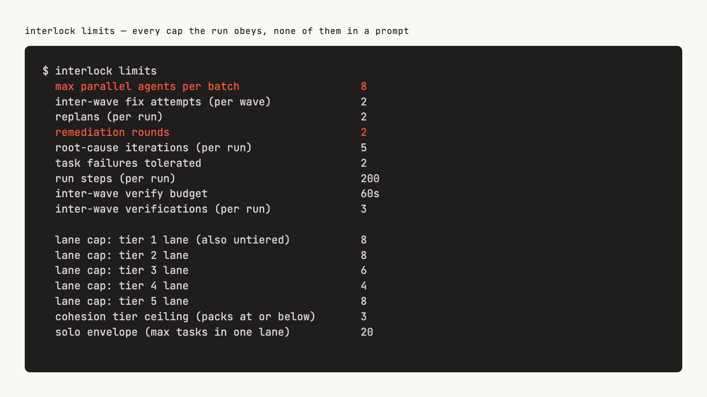

# 07 — The CLIs: reference and configuration

The plugin puts three executables on your `PATH` — `interlock`, `interlock-graph` and `interlock-run` — plus the `interlock-ship-acp` deprecation shim. Every subcommand runs without a model and without the network, with one named exception ([push notifications](#the-one-network-call-push-notifications)). They exist so that any decision the loop made can be re-run by you, on the same inputs, and give the same answer.

This page is the reference. [06 — Why it works](./06-why-it-works.md) explains why each decision moved out of prose; [04 — When it stops](./04-when-it-stops.md) explains every banner these commands print.

---

## Install the CLIs without the plugin

The CLIs are ordinary Node with zero dependencies, and each is useful on its own — `interlock` gates a CI job, `interlock-graph` indexes a repo for any agent, `interlock-run` drives the ship loop over a non-Claude host. They ship as an npm package as well as a plugin:

```bash
npm install -g @renzrollon/interlock
```

Or without installing anything, using the scope on the `-p` flag and the bare binary name after it:

```bash
npx -p @renzrollon/interlock interlock limits
```

| | |
|---|---|
| **Works from the package alone** | `interlock` (the policy engine), `interlock-graph` (build and query the codebase graph), `interlock-run` (drive the loop over the Claude Code CLI, an ACP agent, Codex or Qwen) |
| **Needs the Claude Code plugin** | `/interlock:spec`, `/interlock:ship`, `/interlock:bootstrap` and every other slash command; the `SessionStart` preflight and the `PreToolUse` guards. The package ships the skill and hook files so a package checkout is still a complete plugin, but nothing runs them without the plugin host |

The plugin manifest, `.claude-plugin/plugin.json`, carries the settings hooks inline and names the rest by path: `workflows` names the ship workflow's folder, `hooks/hooks.json` names the hooks module, and `types` names `types/index.d.ts`, the plugin's type contract. The contract declares the one value the hooks module keeps in the session's state, the launch guard's record (`interlock.ledger`), and `claude plugin validate` refuses a state key the module names that the contract does not declare. Every path the manifest names ships in the npm package; `test/spine/package.test.mjs` fails naming any that the `files` list would leave out. Claude Code 2.1.161 does not know the `types` key: it warns `Unknown field 'types'` and ignores it at load time, the settings hooks still run, and only `claude plugin validate --strict` turns that warning into a failure.

---

## `interlock` — the deterministic spine

Each subcommand replaces a judgement the model used to re-derive in prose on every run, usually inconsistently. Every gating command exits 1 when it blocks, so the workflow branches on exit status rather than on parsed prose. `interlock --help` is the authoritative list; this table says what each one decides.

| Command | Decides |
|---|---|
| `interlock waves` | Wave order, the model a lane dispatches on, a **hard cap on parallel agents**, and whether two tasks in one wave would edit the same file. `--mode solo\|waves` forces the plan shape. `--plan <file>` renders a stored plan instead; `--format board\|mermaid` draws it, with `--state <file>` as an overlay and `--columns <n>` as the width ([below](#drawing-a-plan-and-a-run---format-boardmermaid)) |
| `interlock surface` | Whether a diff touches UI, and therefore needs a manual test plan |
| `interlock gate` | Whether a review blocks, which findings are too weak to report, and how the rest partition for parallel fixers |
| `interlock review` | Which findings survive two skeptics, and how many were dismissed versus dropped as too weak. Reads the repo-root `REVIEW.md` and drops findings on its do-not-report paths |
| `interlock review-policy` | What the repo-root `REVIEW.md` actually says once parsed — owner, advice, and any parse problems. See [12](./12-repository-review-policy.md) |
| `interlock remediate` | What gets fixed, what gets deferred, and when the round budget is spent |
| `interlock verify` | What to run (`plan`), what a red result means (`judge`, `unit`), which failures share a root cause (`cluster`), and whether to repair, halt or accept next (`repair`) |
| `interlock wave-state` | What happens next in the wave loop, and when to stop |
| `interlock plan` | Whether a stored wave plan may be reused for this change (`reuse`), keyed on a fingerprint of its planning inputs (`fingerprint`) |
| `interlock merge-lanes` | Whether a batch's isolated lane worktrees fold cleanly back into the shared tree (`--isolate-waves` runs only). A real path collision is a halt naming the path and both lanes, never a guess |
| `interlock paths` | Which paths a commit actually touched (`touched`) and which the plan predicted (`predicted`). Always exit 0; an unreadable set is reported unobserved, never as empty |
| `interlock risk` | How dangerous a change is, from its paths and artifacts |
| `interlock drift` | Which completed changes were never archived, which specs cite files that are gone, and which changed files no spec describes |
| `interlock conformance` | Which spec scenarios a change must be checked against — the questions, never the verdicts |
| `interlock ready` | Whether a change may skip the human checkpoint — fail-closed. See [05](./05-continuity.md) |
| `interlock ledger` | Whether the decision ledger still holds an unanswered product question |
| `interlock validate` | Whether a change is actually implementable |
| `interlock changes` | Which OpenSpec changes are active |
| `interlock tasks` | Whether the wave plan covers every unchecked box (`coverage`), and which ids may be ticked (`tick`) |
| `interlock run-log` | Whether a finished run's trajectory can actually be replayed (`check`), and what it recorded (`list`, `show`, `query`). `show --format board\|mermaid` draws the run as a handoff graph |
| `interlock run` | The whole ship loop, as steps: every briefing and every branch a driver obeys next. `run close` is the only step that exits non-zero — on a halt, or on a run that cannot be reconstructed |
| `interlock doctor` | Whether the host can carry an unattended run: the permission allowlist against the commands the flow shells out to (including the one your own `.claude/testing/profile.json` names), the Node version, the installed plugin's workflow and agent types, the OpenSpec CLI, git, and whether the run-state directories can be written — each one where it lives, so from a linked worktree the trajectory directory is probed in the main checkout. Exits 1 when a check would stop a zero-touch run, prints the settings snippet that fixes it, and changes nothing itself. Its `state-home`, `claude-bare` and `mods` rows are advice and never fail — see the note under this table |
| `interlock limits` | Every cap the loop obeys, so nothing restates one. Its last line adds the concurrency observed on this machine beside the vendor default: `CLAUDE_CODE_WORKFLOW_MAX_CONCURRENT_AGENTS=<n>` when set, otherwise the vendor default and the CPU count that may reduce it. `--json` carries it as `runtime.observed` |
| `interlock notify` | The one outbound request this CLI makes — see below |
| `interlock evals` | Whether an eval results file shows a regression (`triage`), whether a case may move from advisory to blocking (`promote`), how often judged graders agreed with human labels (`calibrate`), and a draft case from a recorded run (`capture`). See [14](./14-evals.md) |
| `interlock report` | Indicators over the three recorded corpora, read from the state home, every value with its denominator. Gates nothing, always exits 0. See [11](./11-the-indicators.md) |
| `interlock outcomes` · `interlock autonomy` | Record a run's outcome, and per-path outcomes for the earned-autonomy ledger. **Nothing reads either to change what the workflow does**: no autonomy level and no accumulated outcome ever relaxes a gate. They exist so the question can be answered later, from evidence |

`--json` on any command emits JSON instead of prose. Any `<file>` argument accepts `-` to read that input from stdin.

Two of `interlock doctor`'s rows are advice, `ok` or `skip` and never `fail`, on the same posture as its `prompt-cache` row. **`state-home`** names the home this root's corpora go to and what the root is — a main checkout, a linked worktree, one of Interlock's lane worktrees — or `skip` with the reason when it could not tell ([the state home](#where-a-runs-records-go-the-state-home)); `doctor --json` carries the resolved `stateHome`, which the SessionStart preflight reads interrupted-run notes from. **`claude-bare`** says whether a bare `claude -p` would have a credential to run on: `ok` when `ANTHROPIC_API_KEY` is set (checked by name, never printed) or an `apiKeyHelper` is configured in a settings scope, `skip` otherwise. It exists because Claude Code's headless docs recommend `--bare` and say it will become the `-p` default, and under it OAuth and the keychain are never read: `--host claude` lanes would then need a key or a helper, and a plugin would load only through `--plugin-dir`. Nothing changes for a run today. **`mods`** says whether the probed `claude` can load the plugin's hooks module, the ship meter and the in-process form of the launch guard ([13](./13-the-guards.md#two-forms-and-which-is-active)): `ok` from Claude Code 2.1.287, `skip` below it or with the version unknown. It names the binary it read (`claude` on PATH, or `INTERLOCK_CLAUDE_COMMAND`), because the engine behind a Desktop Code tab is not that binary; the meter itself logs the engine it loaded in at session start. A host that cannot load mods runs exactly today's run and prints every banner at close.

### Drawing a plan and a run: `--format board|mermaid`

Two commands draw what a run already records, and decide nothing.

- **`interlock waves --plan <file> --format board`** draws a plan as a wave board: one bordered block per wave, one row per lane (its batch, its label, its model, tier and effort, the ids it was ordered after, and the first words of its first task), a verify cell between waves, and a tail naming the gates after the last wave. A lane's row carries its label (`1.1`, `1.1+2`), the name its briefing file, its worktree and its trajectory line carry; its spawn is shown under the lane's title, the same label after `task` or `tasks`. **`--format mermaid`** draws the same plan as a Mermaid `flowchart LR`, never cut. `--classified <file>` with `--format` draws a plan freshly made instead.
- **`interlock run-log show <runId> --format board`** draws a run as a handoff graph from its trajectory, in sequence order: each CLI ping with its exit code and duration, each spawned agent, the packets handed from one wave to the next with their audit verdicts, the halt and the receipt. **`--format mermaid`** draws it as a `flowchart TD`.

**The board keys waves by position, never by group.** Dependency layering can emit a later layer under the same section number, so two waves can share a group; each is its own block, headed `wave <n> · idx <i> · group <g>`.

**`--state <file>` lays a wave state over the plan, and every word it adds is one the state recorded.** A lane reads `ok` or `failed` when the state lists its task as completed or failed; `current` at the cursor's wave and batch; `not recorded` before the cursor when the state lists the task nowhere; and after the cursor `pending`, or `not reached` once the run has halted. A skipped verification is recorded by group, not by position: when two boundaries share that group, the verify cell says the state does not tell which boundary the skip belongs to, rather than pick one. A failure whose id names no planned lane is listed under the board, never dropped. A state whose wave count differs from the plan's is applied by task id only, and the header says so.

**The handoff graph states two caveats where they apply.** Implementer spawn times are the time the step was emitted, not when the host started the agent; and a spawn with no recorded result reads `result: not recorded`, never as finished. Its state and manifest come from the state home beside the trajectory, and only when they name the run; otherwise the header reads `absent`, `unreadable` or `another run <id>`.

The board's narrowest width and its width when neither `--columns` nor a terminal says are printed by `interlock limits` as `wave board min width (columns)` and `wave board default width (columns)`; below the minimum the board is one line saying so. `--format` is a surface of its own and refuses `--json`, as `report --html` does. A plan, state or trajectory that does not exist is spoken (`no plan at <path>`, `no state at <path>` beside a plan-only board, or the line `run-log show` prints for a run never recorded) and exits 0. `docs/10` carries [one generated block](./10-agentic-workflow-ship-and-spec.md#the-plan-drawn).

### The ship meter: `/interlock-meter`

On a host that loads mods (Claude Code 2.1.287+), an interactive session that launches `/interlock:ship` gets the run drawn live, in a terminal and in the Desktop Code tab:

- **A status line**: `interlock: <change> · <action> · wave <w>`, plus `batch <j>/<k>` where the step carries a batch position. The batch position shows on the Workflow host too: the relay that slims a step for that host carries the wave and batch positions. Under an older `interlock` that relays none, the line shows the wave alone. While the run is quiet, ` · quiet <n> min` follows (below). It is cleared at the close or a halt.
- **A toast per degradation banner**, the moment the step that raised it crosses, once per banner text.
- **A toast when the host ends a run agent's turn without an answer**: `<lane> · agent <id> · turn ended: <reason>`, once per agent per run. The reason is the host's own word, repeated verbatim (`aborted`, `refusal`, `error`, or any word a later host sends), and nothing is added to it. `<lane>` names the agent as the pane does: its lane's title (`task 1.1 · Add the relaunch guard`, or `tasks 1.1+2 · …` for a lane of several tasks) or a non-lane worker's label (`plan-waves`, `verify`, `commit`) once the agent is joined to its row, `cli · run next` for a relay ping, and `unmatched agent` before either. The Workflow host raises no spawn event for a workflow agent, so the meter joins each one on the first thing it does: it reads its briefing, `.claude/ship/briefings/<label>.md`, with `Read` or a Bash `cat`, and the path names the spawn. A relay is known by its own `interlock …` line. An agent seen doing neither stays `unmatched agent`, and the pane says why under its agent rows. The meter fires it only when the host reports such an end. A lane the session stopped with `TaskStop` reads `aborted`. The close summary's `AGENT RETURNED NO RESULT` banner stays the record: the driver hands it to the CLI only at the close, so the meter sees it then and not before.
- **A toast when a guard refuses a call**: the guard's own sentence, from its name on (`guard-tests: …`, `guard-tasks: …`, `guard-commit: …`, `guard-relaunch: …`), once per distinct text per run, read off the errored result the engine hands back for the blocked call. The blocked agent still receives the same text as its tool error. A denial that names no Interlock guard, and a command that simply failed, raise nothing. The launch guard's refusals, its own and the settings form's, are toasted in any interactive session, run or no run.
- **`/interlock-meter`**, a pane at any width: the change and run id, the current action, when the run started and when it was last active, in your local time (`started <date> <time> · last activity <time>`, with the quiet word beside it when it applies), the wave board (below), the run's timeline (below), the session's context fill and cost as the engine reports them (`context <tokens> of <window> tokens · <n>% used`, and `session cost $<usd>`, labelled as the engine's total for this session, not the run's), the plan windows your session reports (kind, percent used, reset time, with no threshold and no colour), every banner so far, a `refusals` section (`guard denials: <n> (<guard> <n>, …)` once a guard has refused a call this run, and `launch guard: next launch allowed`, `launch guard: next launch refused: <reason>` or `launch guard: facts unreadable; the next launch is allowed`, the launch guard's current ruling, also drawn when no run is live), and after the close the summary the CLI printed, resume card row included. At run start the meter opens it unasked; the engine seats an unasked pane only in a wide terminal, and otherwise one toast names the command.
  - **The wave board** is the pane's `waves` section, the same fields `interlock waves --plan <file> --format board` prints, laid out as one bordered card per wave (capped at the published default width). Inside a card the lanes are grouped by batch: each batch has a line with the time it was dispatched and `N in parallel` (or `1 lane`), and its lanes are indented beneath it, because the lanes of one batch run side by side and the batches of a wave run one after another. Each lane is up to three lines: the fixed cells (label, model, tier, effort, state word, task ids, `←` with the ids it was ordered after), wrapping as one line when the card is narrow; the task title, wrapping; and, once the lane's agent has spawned, what the host reported serving it and, once its turn ended, how long it took, dim. The state words (`ok`, `failed`, `current`, `pending`, `not reached`, `not recorded`, and `per task` for a lane whose tasks disagree, each task's own word then beside its id) are drawn in your theme's success, error and warning colours (`ok`, `failed`, `current`; the rest dim), the lane's label in the theme's identity colour, and the card of the wave holding a `current` lane is bordered in the warning colour while every other card's border stays dim. A `RED` marker in a wave title is the plan's red-test flag and is not coloured. Between cards sit a verify cell per boundary, and the board ends with the `then:` tail. The state words and the verify cells come from the run's own steps: the plan summary the first batch step carries, the ids each recorded batch names, the skipped verifications and the halt. No file is read for them. Agents that are not lanes (a verifier, a committer) are flat rows beneath the board. Two fallbacks say what they are. Under an older `interlock` that relays no plan, the section reads `plan structure not relayed by this CLI` above one flat row per agent (lane, routed model, served model, effort, state), as the meter drew before. In a pane narrower than the board's minimum, the board's one line naming the width it needs stands above those flat rows. `interlock limits` prints both widths as `wave board min width (columns)` and `wave board default width (columns)`.
  - **The timeline** is the run in the order it happened, each line with its local time (`HH:MM:SS`) in a gutter on the left, blank where the clock gave no reading. One line per CLI step as it crossed (`run-batch · wave 2 · batch 1/2 · 3 in parallel`, `verify · wave 2 · skipped: <reason>`), the relay agent that carried it folded into that line (`cli <id>`, its model, its request count and how long it took). The agents a step spawned are indented beneath it in the order they started, each with its name, id, model and turn (`answer 2m 14s`, `running`) and a dim line of its requests and tokens; a spawn no agent has picked up yet reads `waiting`. A relay whose line printed no step stands at its own time, and agents nothing names are listed last under `unmatched`. Durations read `41.2s`, `2m 14s` or `1h 03m`. Each section's body is indented under its heading. The pane is as tall as the engine seats it; scroll its body to read a long run.

**The pane's colours are your theme's.** Every colour is a theme key (`success`, `error`, `warning`, `suggestion` for identity, `claude` for the accent), so the pane follows a light, dark or colour-blind theme rather than fixed ANSI hues. A colour marks what a word already says and adds no verdict of its own: the run header and the section headings in the accent colour; a lane's label and each agent's name in the identity colour, bold; the board's state words as above; an agent's turn as `running` in warning, `answer` in success and any other host word in error, with relay pings dim; the quiet word and every banner in warning; the guard-denial line, and the launch-guard line when it refuses, in error. The context, cost and plan-window lines are never coloured, because a colour there would read as a threshold the meter does not hold.

**The meter prices nothing.** The session cost on the pane is the engine's own `cost.usd`, the figure the status line shows, already summed over every priced request in the session: the lead session's turns before and after the launch as well as the run's agents. The meter computes no dollar figure of its own and no percent the engine did not send. A figure the host did not answer is said to be absent (`fill not yet reported`, `session cost not reported by this host`). A usage read that fails names its reason on the context, cost and plan-window lines.

**`quiet <n> min` says how long the run has gone without activity, and nothing more.** While a run is live, the meter keeps the time of the last thing the run did, as the engine reports it: the launch, each step the CLI prints, each model request a run agent starts and each answer it gets, each agent's turn end, each spawn. Your own messages and the lead session's own requests do not count. Once nothing has moved for `meter quiet after (ms)`, the status line, the spinner and the pane add the word, in whole minutes, recomputed every `meter tick (ms)`; both caps are printed by `interlock limits`. The next activity clears it. The word names no cause: a run waiting on a plan window looks exactly like a run that hung, which is why the pane lists the plan windows beside it, as the session reports them. A clock the meter cannot read shows no word and `last activity unknown`, never a guessed time.

**`/clear`, `/resume` and `/branch` end the run the meter holds.** They start the session over: the status line is cleared, the pane says no ship run is live, and steps from the earlier run, which may still be going in the background, are no longer drawn (the first is named once on the debug log). The launch guard's record is emptied on the same boundary, so the next launch is allowed. The earlier run's close summary and receipt remain its record. A compaction is not a boundary: the conversation is summarized, the session and its run are the same, and the meter keeps drawing it.

**At session start: `/interlock-preflight` and `/interlock-handoff`.** Outside a run the meter draws one more thing, from the report the plugin's `SessionStart` preflight leaves at `.claude/ship/preflight.json` in an OpenSpec project. When a doctor check failed or warned, the preflight could not run, an interrupted run was spoken, or a halt resume card of an open change is on disk, a band above the prompt shows those lines in the doctor's and the hook's own words, ending `preflight written <time> · /interlock-preflight`; a **Hide** control collapses it until the next session start's report. It appears at your first prompt, since nothing reaches the module before then.

- **`/interlock-preflight`** opens the whole report: the preflight's message, every check with its `fix:` lines, the interrupted runs spoken at this session start with whether each was marked, the halt resume cards listed, how many cards belong to archived changes, and anything the hook could not read. With no report it names the file and why.
- **`/interlock-handoff`** renders each listed card, newest first, as markdown, read from its path when the pane is drawn. A card longer than `handoff pane chars`, printed by `interlock limits`, is cut to it with a line naming the characters left out and the card's path. Neither pane acts on anything it shows.

Every figure is live and display-only, and the pane says so: **the close summary and the receipt are the record.** Nothing draws in a `-p` session, the SDK or a runner lane, and a terminal or Desktop on an older engine draws nothing either. How it stays observe-only is in [13](./13-the-guards.md#the-ship-meter).

<p align="center">
  
</p>

### The spec meter: `/interlock-spec`

The same module draws an `/interlock:spec` run on a mods host, in a terminal and in the Desktop Code tab. It draws from the lines the spec flow already runs, and it decides nothing.

**When it goes live.** Only when the spec skill is loaded in an interactive session: you type `/interlock:spec …`, or the model loads `interlock:spec` through the Skill tool. `openspec` commands alone never start it, so stock `/opsx:propose` draws nothing, and neither does `/interlock:explore` run on its own. The engine raises no skill-load event for a plugin skill (Claude Code 2.1.291 was probed), so the meter reads the load off those two events as they cross. The prompt and the Skill call reach the engine unchanged. A second load starts the meter over.

**Which change.** The status line and the pane read `change: unknown until named` until the CLI names a change, in the argv of `openspec new change "<name>"`, `--change "<name>"`, the name after `interlock ledger`, `validate`, `ready` or `notify checkpoint`, or `--metrics <name>`, or in a result's `changeName` or `change`. A file path or a prompt never names it. When a session touches two changes, the meter draws the one the CLI named last and lists the others.

**The status line** reads `interlock spec: <change> · <stage>`, and the stage is the last thing the flow printed, in the CLI's words:

| stage | from |
| --- | --- |
| `explore`, `explore (<n> investigators)`, `review-artifacts` | loading those skills during the run, and each `Explore` spawn |
| `new change` | `openspec new change` |
| `status <done>/<total> done · next: <id>` | `openspec status … --json`, the artifact ladder as printed |
| `drift (unarchived <n> · broken <n> · aging <n>)` | `interlock drift --json` |
| `ledger blocking (needs_human <n> · invalid <n>)`, `ledger clear (…)`, `ledger missing`, `ledger unparseable` | `interlock ledger … --json` |
| `validate READY`, `validate NOT READY (problems <n>)` | `interlock validate … --json` |
| `gate PASS`, `gate BLOCKED (blocker <n> · warning <n>)` | `interlock gate … --json`, with `metrics not written` when the CLI says so |
| `autonomy record`, `autonomy clean` | the two `interlock autonomy` lines, by their command word only |
| `ready true`, `ready false (blockers <n>)` | `interlock ready … --json` on the `--continue` path |
| `checkpoint` | `interlock notify checkpoint` |

A keyed line that printed no JSON, or JSON without the fields the line names, reads `<line> (unparsed)`. Its first line of output goes on the pane, and the debug log gets one line naming the reason. A name the CLI could not resolve reads `<line>: change not resolved`. The meter reads a keyed line that begins a command, or one between `&&`, `||` or `;` in a chained command. The lines it reads by their argv alone (`openspec new change`, `interlock autonomy`, `interlock notify checkpoint`) count from any position. A line whose output it reads counts when it is the only such line in the command. Two of them in one command are both shown as unparsed (`compound command`), because their output cannot be told apart. A line run in another form, such as behind a `cd …` with no separator or through a variable, is not read and stays `not run yet`.

**`/interlock-spec`**, a pane at any width, opened unasked at the load, with one toast naming the command when the engine declines to seat it. It shows:

- the change and its schema
- the artifact table exactly as the last `openspec status --json` printed it (`id · status · outputPath`, with `applyRequires`)
- `explore: <n> investigators spawned` and the brief's path
- the drift, ledger, validate, gate and readiness results by their JSON field names, or `not run yet`
- the last autonomy command
- a `writes` section: each artifact file written through the Write or Edit tool, with its count and last time, and the findings file's path
- `last activity <time>`
- once they happen, `checkpoint reached <time>` and `handed over to ship at <time>`
- the line `the artifacts on disk, the findings file and the gate's exit are the record`

Writes and spawns are counts. A file written since the last status call has no status beside it, because only the CLI's table says what is done.

**Three ends.** At `interlock notify checkpoint` the run stops at its checkpoint. The status line keeps reading `checkpoint`, because the checkpoint waits for you, and later keyed lines change nothing. An accepted ship launch hands the one status line to the ship meter before the ship run goes live, so the two lines never show together, and the spec pane keeps the readiness result. `/clear`, `/resume` and `/branch` end the spec run with the ship run. A compaction does not.

**What it never says:** no `quiet <n> min`, because spec waits on you by design. No `complete`: OpenSpec's own roll-up is not read. No `ready to ship`, no autonomy level or count, no threshold, and no tick from a file being present. It writes nothing and reads no file. Nothing draws in a `-p` session, the SDK or a runner lane. How it stays observe-only is in [13](./13-the-guards.md#the-ship-meter).

### Where the loop itself lives

The wave loop, the halt conditions and the verification order live in `lib/run.mjs`, which emits the whole program as steps — the agents to spawn, with their briefings, and the exact `interlock` argv to call once they return. `workflows/ship.js` and the experimental `bin/interlock-run` are interpreters of that program, not two copies of it: each spawns what a step names and calls what it names next, and branches on nothing — not a flag, not a mode, not a count, not a verdict. Control flow written as prose is control flow the model can talk itself out of; control flow written twice in two drivers is control flow that drifts.

Without a shape flag, the classifier recommends `solo` or `waves` and the planner honours it inside the envelope `interlock limits` publishes; `--solo` and `--waves` force it. The plan preview names the mode before anything is spawned.

Tasks in a wave run in parallel in one working tree. The planner takes each task's predicted file list and moves any task that would collide with a sibling into a later batch of the same wave. Collision is compared on the **canonical** path, so `src/a.ts` and `./src/a.ts` are one file; a path that is absolute or escapes the repo root is reported as unusable rather than rewritten into scope. After that, consecutive batches that each hold one lane are fused into one chain lane — they were already serial — and a batch of two or more lanes is left parallel. The prediction is still a model's — but with `--isolate-waves`, each lane in a batch runs in its own git worktree, so a mis-predicted shared write can no longer overwrite a sibling lane. Their worktrees fold back afterward (`interlock merge-lanes`); a prediction miss surfaces as a named halt at merge time, never as a silently discarded write. Each isolated batch forks from a snapshot of the shared tree rather than from HEAD, which does not move until the ship commit, so a later batch or wave starts from every earlier fold. That snapshot carries untracked files `.gitignore` does not exclude, so they now reach the lane trees; an ignored generated file still does not. On the Workflow host, whose runtime forks lanes from `worktree.baseRef`, `--isolate-waves` is bannered at `run start` and halts with `LANE BASE MISMATCH` after the first fold until a follow-up change.

### Where a run's records go: the state home

A ship run writes two kinds of file. Its working state — the run manifest, the wave state, the briefings, the spill, the stage marker, the agent-usage sidecar — belongs to the tree it works on. Its corpora — the trajectory, the outcome line, the review metrics, the resume card, the interrupted-run note, the autonomy ledger — belong to the project, because `interlock report` reads every run the project has had. In a main checkout the two are one directory. In a linked worktree they are not, and the corpora go to the **state home**: the main checkout, found from git's common directory. Interlock's own lane worktrees are always their own home. [11](./11-the-indicators.md#where-they-live) has the full split, and [04](./04-when-it-stops.md#corpora-in-main-checkout-and-corpora-in-state-home) what a run in a worktree prints.

| Flag / variable | Effect |
|---|---|
| `--state-home <dir>` | Pins the state home. On `interlock run start` it is recorded on the run manifest, and every later `run` step uses the recorded home. On the commands that read or write a corpus — `report`, `run-log`, `outcomes`, `review --metrics`, `gate --metrics`, `evals capture`, `autonomy`, `wave-state`, `verify judge` and `doctor` — it names the home for that invocation. `--state-home .` keeps a worktree's records in the worktree. |
| `INTERLOCK_STATE_HOME` | The same, when no flag is given. |

Without either, a command uses the home that the run manifest at its root recorded, so a lane's `wave-state` append or a report taken mid-run agrees with the run; with no manifest it asks git. When git cannot answer, the home is the root and `run start` banners `STATE HOME UNRESOLVED`. A pinned home never changes the surface a run records — `main`, `linked-worktree`, `lane-worktree` or `unknown` — because the surface describes where the session is, not where its records go.

**`--root` is not the override.** It keeps its meaning: the working tree the command operates on. `interlock-run` passes `--root .` on every call it makes, so a rule that switched resolution off whenever `--root` was given would switch it off on the host most likely to run in a worktree.

The two inputs a fresh worktree lacks are read through, never copied. `run start` looks for `.claude/testing/profile.json` and `.claude/graph/graph.json` in the root first and the state home second, records the path it used on the manifest, and says which it read: `TEST PROFILE FROM MAIN CHECKOUT`, `GRAPH FROM MAIN CHECKOUT`, or `NO TEST PROFILE` / `GRAPH UNAVAILABLE` when neither place has one. No driver probes either file any more.

---

### A slower suite: the per-repository verify budget

Inter-wave checks share one budget per run. Past it, a checkpoint runs typecheck only. The default fits a fast suite, and a compiled solution can spend it on its first checkpoint, build included. A repository whose checks are slower sets its own budget with `inter_wave_verify_budget_ms` in `.claude/testing/profile.json` (`shared/TEST-PROFILE.md`). The default and the ceiling a profile may ask for are both in `interlock limits`.

`run start` reads the value once and records it on the manifest. Every checkpoint of that run compares against the recorded value, so a profile edited mid-run changes nothing until the next run. The run says which budget it used:

- `VERIFY BUDGET FROM PROFILE: <n>s (inter_wave_verify_budget_ms)` when the profile set it.
- `VERIFY BUDGET CLAMPED: profile asks <n>s …, ceiling is <n>s` when the value was above the ceiling.

Without the field, nothing is printed and the default applies. `unit.timeout_ms` does not change the budget. `/interlock:fix-tests` never writes this field: the number is a person's decision.

## The one network call: push notifications

A ship run that halts or completes while nobody is watching can push you a message. It is off by default. Nothing is read from or written to the repo tree for this. Inside Claude Code the same two values can be set as plugin options (`ntfy topic`, which is masked, and `ntfy server`). Session start copies a set option into the session when the matching variable below is not already set. A variable you already provided wins.

| Variable | Meaning |
|---|---|
| `INTERLOCK_NTFY_TOPIC` | The [ntfy](https://ntfy.sh) topic to post to. Unset (the default) means `run close` posts nothing, and the suite never makes a request. Treat the value as a secret — anyone who knows it reads every message, since it is the only authentication the public server offers. |
| `INTERLOCK_NTFY_URL` | The ntfy server, defaulting to the public `https://ntfy.sh`. Point it at a self-hosted server if the public relay is not an acceptable trust boundary for your halt reasons. |

With a topic set, both `workflows/ship.js` and `bin/interlock-run` pass `--notify` on every close, so one message goes out per terminal outcome — `high` priority on `SHIP HALTED`, default priority otherwise — naming only the summary's first line, the change and the run id, never the topic, the working directory or the project slug. A failed push shows up as `push: failed — <reason>` in the summary and a `PUSH FAILED: <reason>` banner, and never changes the run's exit code. See [when it stops](./04-when-it-stops.md#push-failed) for the failure modes, or run a one-off yourself:

```bash
interlock notify --title "<title>" --body "<body>"
```

---

## `interlock-graph` — the local code knowledge graph

A deterministic code knowledge graph under `.claude/graph/`. No vector store, no network. Agents navigate with token-budgeted subgraphs instead of re-grepping:

```bash
interlock-graph build .
interlock-graph consumers normalizeEmail
interlock-graph path lib/auth app/api
interlock-graph context "<query>" --budget 2000
```

`build` indexes, `update` rebuilds incrementally, and `query`, `consumers`, `path`, `explain`, `docs` and `context` read it back within a token budget. `/interlock:bootstrap` builds it for you; `interlock-graph --help` lists every option.

**In a linked worktree.** `.claude/graph/` is gitignored, so a fresh worktree has no graph. The commands that read the graph — `query`, `consumers`, `path`, `explain` and the graph half of `context` — read `<root>/.claude/graph/graph.json`, and when the root has none they read the [state home](#where-a-runs-records-go-the-state-home)'s instead and print one line on stderr, `GRAPH FROM MAIN CHECKOUT: <path>`, because that graph was built before this worktree's edits. `build`, `update`, `report` and `docs-index` write under the root they are given and never into the main checkout, so building a graph in the worktree makes it the one every later query finds first.

**Language coverage.** Structural indexing — import and symbol edges — covers **JavaScript/TypeScript, Python, and shell**. Other languages (Go, Rust, Java, Ruby) get everything else: docs and OpenSpec indexing, spec→file links, prose retrieval, and the full workflow. When `interlock-graph build` finds nothing to index it says so and explains why, rather than reporting an empty graph as success. Everything else in the plugin is stack-agnostic; `bootstrap` reads your dependency manifest and phrases its explorer agents in your stack's vocabulary.

---

## Model routing

The planner assigns a slug — `haiku`, `sonnet` or `opus` — to every spawn. A lane of two or more tasks is `opus` when its hardest tier is at or above the published multi-task opus floor (`LANE_CAPS.opusMinTier`, printed by `interlock limits`); below that floor it is `sonnet`. A lane of one task is that task's clamped model. On Claude Code those pass through unmapped. These environment variables change what actually runs. `interlock run start --host workflow` reads the first three from its own environment, against the version `claude --version` reports, and `interlock doctor`'s `claude-env` row prints the same reading before a run:

| Variable | Meaning |
|---|---|
| `CLAUDE_CODE_SUBAGENT_MODEL` | **Leave it unset.** From Claude Code 2.1.251 it sets only the *default* subagent model, and the model each spawn names wins. The run notes it (`MODEL ROUTING NOTE`) and the plan's tiers apply. On an older host, or when the version cannot be read, it overrides every per-tier model the planner assigned, so `ship` runs entirely on that model. The run banners this as `MODEL ROUTING OVERRIDDEN` rather than hiding it — see [04](./04-when-it-stops.md#model-routing-overridden). |
| `CLAUDE_CODE_SUBAGENT_MODEL_FORCE` | **Leave it unset.** Set to `1` on Claude Code 2.1.257 or later, it forces one model onto every agent, whatever the plan or the spawn asked for. The run banners `MODEL ROUTING OVERRIDDEN: CLAUDE_CODE_SUBAGENT_MODEL_FORCE=1` and records the Workflow host's model selection as `forced`. |
| `CLAUDE_CODE_WORKFLOW_MAX_CONCURRENT_AGENTS` | The Workflow runtime's concurrency (vendor default 16, which the runtime may reduce on a small machine). Interlock never resizes a plan to it. A batch wider than an override is bannered `WAVE WIDER THAN RUNTIME SLOTS`, and the extra lanes queue. `interlock limits` prints what it observed. |
| `CLAUDE_CODE_EFFORT_LEVEL` | **Leave it unset.** If set, the Claude CLI applies it to every agent, above its own `--effort` flag and above every per-step effort the plan assigned from `interlock limits`. Both drivers banner it as `EFFORT ROUTING OVERRIDDEN`, and neither strips it — see [04](./04-when-it-stops.md#effort-routing-overridden). The runner banners it on `--host claude` and on `--host acp` when the command is the Claude binary or a known wrapper (`claude-agent-acp`, `claude-code-acp`). |
| `INTERLOCK_MODEL_MAP` | Runner only. A JSON object keyed by host id, each entry mapping the planner's slugs to that host's model ids. Codex and Qwen have no idea what the slugs mean, so an unmapped spawn there gets **no model flag** and is named in a `MODEL ROUTING UNAVAILABLE (<host>)` banner with its reason — never quietly run on your default. Map `opus` as well as `sonnet`: a multi-task lane whose hardest tier clears the opus floor (and every solo lane) still asks for `opus`. `INTERLOCK_ACP_MODEL_MAP` is an alias of the `acp` entry. |

```bash
export INTERLOCK_MODEL_MAP='{"codex":{"haiku":"gpt-5-mini","sonnet":"gpt-5","opus":"gpt-5-pro"}}'
```

---

## `interlock-run` — the experimental runner

`/interlock:ship` runs on Claude Code's Workflow runtime and nowhere else. `interlock-run` is a second implementation of the same host contract (`lib/host.mjs`: spawn one labeled agent, spawn a batch, run `interlock` and branch on its exit code) over a vendor coding CLI. You start it yourself; no slash command starts it for you, and `/interlock:ship` never falls back to it.

```bash
interlock-run <change-name> --host claude
INTERLOCK_ACP_COMMAND="<your-acp-agent>" interlock-run <change-name> --host acp
```

| `--host` | Drives | Result schema | Model selection | Effort | Plugin hooks | Token usage | Billing path |
|---|---|---|---|---|---|---|---|
| `claude` | `claude -p` | enforced by the CLI | the planner's slugs, passed through | `--effort`, when the CLI's help lists it | yes (`--plugin-dir`) | yes | Anthropic, programmatic |
| `acp` | your `INTERLOCK_ACP_COMMAND` | recovered from text | negotiated on `session/new` | negotiated with `session/set_config_option`, when advertised | only over the Claude binary | no | whatever the agent is |
| `codex` | `codex exec` | enforced by the CLI | mapped, or unrouted | **not routed** | **no** | yes | ChatGPT plan or API key |
| `qwen` | `qwen -p` | enforced by the CLI | mapped, or unrouted | **none** | **no** | no | whatever you configured |

An adapter under `lib/host/` is a transport plus a declaration of what that host cannot do, and the run program reads the declaration rather than branching on a name. What that means for a run:

- **The whole loop, including `--strict`.** Adversarial review, bounded remediation, the verdict and the handoff artifacts are steps `interlock run` emits, so every host interprets them the way it interprets a batch. A strict run here halts on the same terms as one on Claude Code.
- **A lane reaches the CLI that wrote its briefing.** Briefings name `interlock` bare. The runner puts the directory of the binary it runs first on each lane's PATH and drops any later copy of that directory, so the name resolves to the CLI that emitted the step. A headless session appends plugin `bin/` directories after the PATH it inherited, which is why the directory placed first wins. The rest of the environment is the operator's, including `CLAUDE_CODE_EFFORT_LEVEL`.
- **Isolation is the runner's, on every host.** Under `--isolate-waves` the step names one worktree path per lane, the runner creates it from the batch's merge base — a snapshot of the shared tree, never HEAD, so a later batch sees every earlier fold — and `interlock run record-batch` halts with `LANE BASE MISMATCH` before folding anything if a lane's worktree is not checked out at that snapshot, then folds the clean lanes and halts naming the path and both lanes when two of them mutated the same file — created, modified or deleted it, so a rename's source counts against a lane that edited it.
- **The runner names the billing path it is on.** Every summary prints `RUNNER HOST: <id> (experimental)`. A run over the Claude binary — directly, or through ACP — prints `SUBSCRIPTION PATH: programmatic`, because `claude -p`, the Agent SDK and ACP are the usage Anthropic flagged for separate metered credit; the interactive Workflow runtime is the path that change exempted, which is why `/interlock:ship` stays the default and this runner is not started for you. A Codex run with neither `CODEX_API_KEY` nor `OPENAI_API_KEY` prints `CHATGPT PLAN PATH`. A host with no hooks prints `HOOKS NOT IN FORCE (<host>)`. The receipt records the host, its billing path and its hook availability.
- **What a host cannot do is declared, not discovered.** Codex and Qwen have no equivalent of the `PreToolUse` guards, so nothing stops a repair step from weakening a test there except the CLI's own unit-suite shrink check. Qwen reports no token accounting, so every wave and the run total are recorded as `unknown` — never as zero.
- **Effort is forwarded, and what landed is reported per spawn.** Each spawn carries the effort `interlock limits` publishes for it, or none, and the runner hands it to the adapter unchanged. Each host declares an `effort` capability — `flag`, `negotiated` or `unsupported` — recorded in the manifest and in the receipt's host block. `--host claude` reads the CLI's `--help` once, when the host is created, to see whether it has the `--effort` flag; a CLI without it, or one whose help cannot be read, is declared `unsupported` for the run and is passed no flag, so it does not reject the spawn. The summary says `effort routing: applied on N/N spawns`, or prints `EFFORT ROUTING UNAVAILABLE (<host>)` with one line per spawn that missed, naming the level it requested and the reason. A missed effort never fails a spawn.
- **What the host saw is read whatever the exit code, and travels on its own channel.** On `--host claude` the adapter reads the whole `claude -p` envelope — subtype, error flag, errors, permission denials by tool name, session id, turn count, the models the session called — and the lane session's own transcript for the models that served its turns. The runner writes those host records to `host-records.json` beside `results.json` and passes `--host-records <file>` on every continuation; `interlock run` accepts `--host-records <file|->` on every subcommand that accepts `--results`. A result is the agent's report and a host record is the host's observation, so the two never share a file, and the runner reads no field of a record: the CLI raises `LANE STOPPED BY HOST`, `SCHEMA RESULT MISSING (claude)`, `TOOLS DENIED IN LANE` and `MODEL SUBSTITUTED` from them and appends one `agent-result` trajectory event per lane ([04](./04-when-it-stops.md#lane-stopped-by-host-schema-result-missing-claude-and-tools-denied-in-lane)). The Workflow driver passes none.
- **No prompt the runner would wait on.** The default permission mode is `bypassPermissions`, which asks nobody anything. Set `INTERLOCK_CLAUDE_PERMISSION_MODE` to another mode and a lane can ask for permission with nobody there to answer, so the adapter adds `--permission-prompts none` — only when the CLI's `--help`, read once when the host is created (the same read that decides `--effort`), lists the flag, because a CLI that does not know a flag rejects the whole invocation. A CLI that does not list it gets no flag and a `PERMISSION PROMPTS NOT SUPPRESSED (claude)` banner. Under the default mode the argv is unchanged. The adapter never passes `--no-session-persistence` — the lane's transcript is where its served models are read, and what `claude --resume` needs — and passes `--plugin-dir` whenever the checkout is the plugin.
- **The zero-touch contract is weaker.** On Claude Code nobody can interrupt a run because the runtime has no channel for it. Here the driver just declines to ask — a policy in a file, not a property of a runtime.

Every banner the runner prints, with what to do about it, is in [04 — When it stops](./04-when-it-stops.md#runner-host-id-experimental-and-the-rest-of-the-runners-banners). `interlock-ship-acp` still works and prints a deprecation line; it is removed in the next minor version. **Code Mode is out of scope**: running the loop as generated code against a tool API would need Interlock to own a runtime to execute that code in, which it does not — future work, contingent on that, not a supported ship host today.

---

## Environment variables, in one place

| Variable | Read by | Effect |
|---|---|---|
| `INTERLOCK_NTFY_TOPIC` | `interlock notify`, `run close --notify` | Enables push notifications. Unset: no request is ever made |
| `INTERLOCK_NTFY_URL` | same | ntfy server; default `https://ntfy.sh` |
| `INTERLOCK_MODEL_MAP` | `interlock-run` | Planner tier slug → host model id, per host |
| `INTERLOCK_ACP_MODEL_MAP` | `interlock-run --host acp` | Alias of the `acp` entry above |
| `INTERLOCK_ACP_COMMAND` | `interlock-run --host acp` | The ACP agent command to drive |
| `INTERLOCK_RUN_HOST` | `interlock-run` | Default for `--host` |
| `INTERLOCK_CLAUDE_PERMISSION_MODE` | `interlock-run --host claude` | The lanes' `--permission-mode`; default `bypassPermissions`. Any other mode adds `--permission-prompts none` where the CLI lists it, and a `PERMISSION PROMPTS NOT SUPPRESSED (claude)` banner where it does not |
| `INTERLOCK_STATE_HOME` | `interlock run start` and every command that reads or writes a corpus; `interlock-graph`'s query commands | Pins the [state home](#where-a-runs-records-go-the-state-home) when no `--state-home` is given |
| `CLAUDE_CODE_SUBAGENT_MODEL` | Claude Code; `run start --host workflow` | **Leave unset.** Below 2.1.251, or with the version unknown, every tier runs on that model (bannered); from 2.1.251 it is only the default (noted) |
| `CLAUDE_CODE_SUBAGENT_MODEL_FORCE` | Claude Code; `run start --host workflow` | **Leave unset**, or every agent runs on one model (bannered, model selection recorded `forced`) |
| `CLAUDE_CODE_WORKFLOW_MAX_CONCURRENT_AGENTS` | Claude Code; `run start --host workflow`, `interlock limits` | Workflow runtime slots. Observed and printed, never used to resize a plan |
| `CLAUDE_CODE_EFFORT_LEVEL` | Claude Code | **Leave unset**, or every agent runs at that effort, whatever the plan assigned (bannered as `EFFORT ROUTING OVERRIDDEN`, never stripped) |
| `CLAUDE_CODE_DISABLE_WORKFLOWS` | Claude Code | **Must be unset**, or `/interlock:ship` cannot start |
| `CLAUDE_CODE_WALNUT_SPIRE` | `claude plugin eval` | Maintainers only: enables the early-access eval harness. Environment only, never committed — see [14](./14-evals.md#running-the-model-evals) |

---

## Next

[**11 — The indicators**](./11-the-indicators.md) — what `interlock report` reads from the corpora these commands write, and why it gates nothing.
