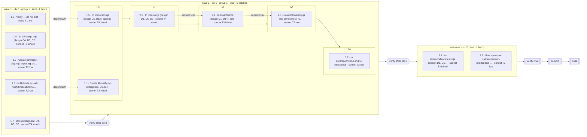

## Context

See proposal.md for the motivation. What shapes the approach, each fact read off the code on 2026-10-06:

- **The lane rule is in a module the engine cannot load.** `lib/waves.mjs` imports `randomUUID` from `node:crypto` (`:103`) and `LIMITS, EFFORT, LANE_CAPS, SOLO, clampParallel` from `./limits.mjs` (`:105`). The five lane functions sit at `:471` (`laneTier`), `:519` (`laneLabel`), `:538` (`laneTitle`, with `TITLE_SEPARATOR` exported at `:524` and the unexported `TITLE_MAX = 48` at `:527`), `:560` (`laneModel`, which reads `LANE_CAPS.opusMinTier`) and `:585` (`laneEffort`, which reads `EFFORT.byTier`). None of them touches `node:crypto`. They are imported from `lib/waves.mjs` by `lib/run.mjs:72-73`, `bin/interlock:37`, `lib/plan-fingerprint.mjs:39`, `test/spine/waves.test.mjs:27-28` and `test/spine/plan-fingerprint.test.mjs:44`.
- **The trajectory reader is Node.** `lib/run-log.mjs:36-46` imports `node:fs` and `node:path`. `readRunLog` (`:782-807`) returns `{ path, exists, records, skipped, reason }` with `records` in file order, not `seq` order, and a torn line in `skipped`. `formatRunLog` prints `RUN LOG — none recorded (<path>)` for a run with no file (`:1061-1062`).
- **The import walker is in a test file.** `specifiers` (`test/spine/mod-pins.test.mjs:101-109`) and `walkModule` (`:120-140`) are exported from the test file itself; two tests use the walker (`:276-286`), and no other file imports it.
- **The CLI's shape.** `interlock waves` is `bin/interlock:1797-1811`: `readInput(flags.classified)` → `planWaves` → `emit(json, plan, formatPlan(plan))`. `run-log show` is `:2360-2364`: `readRunLog(logHome, runId)` → `emit(json, result, formatRunLog(result))`, where `logHome = corpusHome(root, flags).home` (`:2346`, `:908-922`). `report --html` refuses `--json` with `die('--html and --json are mutually exclusive: choose one surface')` (`:1920`). `die` writes `interlock: <message>` to stderr and exits 1 (`:942-945`). `readInput` dies on a missing value and on invalid JSON (`:924-931`). `num` dies on a non-number (`:1684-1689`). No subcommand reads `--format` today; `--plan` and `--state` are value flags already read by `wave-state` and `run-log check`.
- **Where a run keeps what.** `MANIFEST_PATH` and `STATE_PATH` are `.claude/ship/run.json` and `.claude/ship/state.json` (`lib/run.mjs:116-117`). The manifest and the wave state stay in the run's root while the corpora, the trajectory among them, go to the state home (`lib/run.mjs:951-964`); in a main checkout the two are the same directory. `readManifest` accepts only `schema: 'interlock.run/1'` (`:236-243`). The manifest's `dispatched[]` entries are `{ wave, label, kind, model, sha }`, with `wave` the step's group, not its position (`:3587-3599`).
- **What the wave state records.** `createRunState` drops waves with no batches (`lib/waves.mjs:2134`) and appends the test wave last with `kind: 'test'` and `group: null`. A verification is entered at every boundary that has a following wave, the impl-to-test boundary included (`:2439-2470`); a docs-only, red or cap-reached wave pushes its skip without entering one, and a skipped check pushes `{ wave: group, waveKind, reason }` (`:2444-2467`, `:2623`). `recordBatchResult` pushes a task to `completed` or to `failures`, never both (`:2423-2431`). The packets the next wave is briefed with are the previous position's tasks that hold a packet, each with its audit (`previousWaveHandoffs`, `:2270-2290`, unexported).
- **The real records.** `.claude/ship/plan.json` predates `wave.kind`: its two waves carry `group: 1` and no `kind`, its `testWave` has two lanes, its `deferred` holds four records (`1.1 ← 1.3`, `1.5 ← 1.6`, `2.2 ← 2.1`, `2.3 ← 2.2`) and its `lanes` and `effort` lists are empty because every lane is one task. `.claude/ship/state.json` names run `6e9d0b02-c70b-4d7a-9865-fa892722cecb`, holds three waves, cursor `{ waveIndex: 1, batchIndex: 1, phase: 'batch' }`, completed `1.7 1.4 1.2 1.3`, failures `task-1.6-verify-settings` (error `null`), `1.5` and `1.1`, one skip `{ wave: 1, reason: 'no-detectable-command' }`, packets for `1.7 1.4 1.2` (`ok`) and `1.3` (`partial`), all four audits `confirmed`, and a `task-failures` halt. The trajectory holds 26 records; the first two are `wave-state create` (seq 1-2), before `run-start` (seq 3); it has no `agent-result` record.
- **The sibling's terms.** `draw-the-wave-board-in-the-meter-pane` imports the board from the hooks module, adds a plan summary that keeps of a task only `id`, `tier`, `model` and `description` and of a wave only its position, group, kind, red marker and batches, and later asks for a keyed rows form beside the lines form (its `specs/ship/diagrams/spec.md`). The board this change writes has to draw from exactly those fields so the summary can stand in for the plan.

## Goals / Non-Goals

**Goals:**

- Two modules whose whole contract is a function from records to an array of lines, importable by `bin/interlock` today and by `hooks/mod.mjs` without change tomorrow.
- One naming rule for a lane, one cut rule for a row, one walker for a closure.
- Every word on a drawing traceable to one field of one record, and every join that a record does not force printed as unplaced.

**Non-Goals:**

- A live board. The pane is the sibling's; nothing here reads a host event.
- A diagram in the HTML report, a Mermaid runtime, an SVG, a colour, a style directive.
- Timing. No Gantt, no elapsed time beyond the `durationMs` a `cli-exit` recorded; `deriveWaveElapsed` keys on the group string and is left as it is.
- A new record. No trajectory type, no step field, no state key, no `$.` call.
- Re-deriving the plan. The board never calls `planWaves`, never reads `task.dependsOn`, and never consults `plan.lanes` or `plan.effort`.

## Decisions

### D1 — Two renderers under `lib/`, pure, with a closure of `lib/lane.mjs` and `lib/limits.mjs`

`lib/draw-plan.mjs` draws a plan; `lib/draw-run.mjs` draws a run. Each imports from `./lane.mjs` and `./limits.mjs` and from nothing else, so neither reaches `node:` through any path, and each reads nothing it was not handed: no file, no `process`, no `Date`, no `performance`, no `globalThis`. The CLI does every read and every width lookup against the terminal; the modules do every join and every cut.

*Why.* The hooks module can import any file whose closure is Node-free and inside the plugin (`test/spine/mod-pins.test.mjs:120-140`), and nothing else. A renderer inside `lib/waves.mjs` or `lib/run-log.mjs` would be unreachable from the pane. A renderer that read its own files would be untestable without a scratch root and would hand the pane a file read it is forbidden.

*Alternatives.* Extend `formatPlan` and `formatRunLog`: both live in Node modules, and the proposal pins `formatPlan`'s text byte-identical. One module for both diagrams: the pane needs only the board, and a module that also joins trajectories is weight the hooks module would load for nothing.

### D2 — The public surface

`lib/draw-plan.mjs`:

- `drawPlanBoard(plan, opts = {}) → string[]`. `plan` is any object; the board reads of it `waves`, `testWave` and `deferred` only, of a wave its position, `group`, `kind`, `red` and `batches`, and of a task `id`, `tier`, `model` and `description` (through the lane functions). `opts.columns` is a number; anything but a positive integer means `LIMITS.waveBoardDefaultColumns`. `opts.state` is a wave state or `null`. `opts.stateNote` is a string the CLI passes to say why there is no overlay (`no state at <path>`); the header prints it beside `plan only`.
- `drawPlanMermaid(plan, opts = {}) → string[]`. `opts.state` as above; `opts.source` is the text of the `%% source:` comment (default `plan`). Mermaid is never cut, so it takes no width.
- `STATE_WORDS`, frozen: `ok`, `failed`, `current`, `pending`, `not reached`, `not recorded`.

`lib/draw-run.mjs`:

- `drawRunBoard(run, opts = {}) → string[]` and `drawRunMermaid(run, opts = {}) → string[]`, where `run = { runId, path, records, skipped, state, manifest }`: `records` and `skipped` are `readRunLog`'s, in any order; `path` is the trajectory path for the source comment; `state` and `manifest` are each `{ value, read }` with `read` one of `ok`, `absent`, `unreadable` and `value` the parsed object or `null`. `opts.columns` as for the plan board.

Neither function throws on any input: a non-object plan is the no-waves board, a non-array `records` is zero records, a missing `state` or `manifest` is `absent`.

The board is composed internally as rows of `{ key, text }` (`header`, `wave:<position>`, `lane:<label>`, `verify:<position>`, `tail`) and the export returns their texts. The keys are not exported here. The sibling's rows form is then an added export over the same composition, not a second drawing.

*Why lines.* The pane's rows are one `Text` per line with no colour (`hooks/mod.mjs:409-434`), the CLI prints lines, and a test compares arrays. *Why `{ value, read }`.* The renderer decides `this run` versus `another run <id>` because that is a join over two records. Only the CLI can tell an absent file from an unreadable one, so it passes that fact rather than a guess.

*Alternative.* Pass paths and let the module read: it would no longer be importable by the hooks module.

### D3 — `lib/lane.mjs` owns the lane rule and the row cut; `lib/waves.mjs` re-exports

`laneTier`, `laneLabel`, `TITLE_SEPARATOR`, the unexported `TITLE_MAX`, `laneTitle`, `laneModel` and `laneEffort` move to `lib/lane.mjs` with their doc comments, unchanged in body. `lib/lane.mjs` imports `EFFORT` and `LANE_CAPS` from `./limits.mjs`. `lib/waves.mjs` imports the five functions for its own use and re-exports them and `TITLE_SEPARATOR` with `export { … } from './lane.mjs'`, so every importer listed in Context is unchanged and `test/spine/waves.test.mjs` keeps its imports.

`lib/lane.mjs` also exports `fitRow(text, columns)`: the text unchanged when its length in code points is at most `columns`; otherwise its first `columns - 1` code points and `…`, so the result is exactly `columns` wide. Both renderers cut every row with it, so a plan board and a run board cut alike, and the pane's `wrap: 'truncate-end'` cuts at the same place.

*Why here.* The cut is the sibling of the title rule, which already gives way with an ellipsis (`lib/waves.mjs:545`), and both renderers need it. Put in `lib/draw-plan.mjs`, it would make `lib/draw-run.mjs` depend on the plan renderer, and the two could not be written side by side. *Why `laneTitle` keeps its own cut.* It trims before the ellipsis (`trimEnd()`), and the title is a spawn's identity on screen; changing its body changes what every run displays.

### D4 — The board's row grammar and its cut

At width `W` (resolved per D2), below `LIMITS.waveBoardMinColumns` the board is one line: `wave board needs at least <min> columns; <W> given`. Otherwise, in order:

1. **Header.** `plan · <n> waves · <t> tasks · ` then one of: `plan only` (with `(<stateNote>)` when given); `run <first 8 of runId> · cursor idx <i> b<j>` plus ` · verify` when the phase is verify, plus ` · halted` when the state holds a halt; or `overlay by task id only: state has <s> waves, plan has <p>`. A plan with no waves reads `plan · holds no waves · plan only`. `<n>` counts the test wave as one more position.
2. **One block per wave**, in position order, the test wave last at the next position:
   - `┌─ wave <i+1> · idx <i> · group <g> · <kind> · <b> batch(es)[ · RED] ` filled with `─` to exactly `W`; the test wave's top rule reads `test wave · idx <i> · test · <b> batch(es)`. A wave with no `kind` (a plan written before kinds, as the fixture is) is `impl`.
   - One row per lane: `│ b<j> <label> <model> T<tier> <effort>[ <state>][ [<ids>]][ ←<after>] · <gist>`. Label, model (six), effort (seven) and state (twelve) are padded so the columns align across the board. `<model>`, `<tier>` and `<effort>` are `laneModel`, `laneTier` and `laneEffort` of the lane; tier 0 prints `T?`, a `null` effort prints `inherit`. `[<ids>]` appears only for a lane of two or more tasks. `←<after>` is the comma-joined union of the `after` ids of the plan's `deferred` records for the lane's tasks, minus the lane's own ids, in record order. `<gist>` is `laneTitle(lane)` with its leading `<label> · ` removed, so the label and the gist read together are the spawn's title, word for word.
   - `└` followed by `─` to exactly `W`.
   - Between two blocks, the verify cell `  verify after idx <i>`, with the overlay's text (D5) appended.
3. **Unplaced failures** (D5), one line each.
4. **Tail.** `then: verify-final → commit → close`, then ` · halted: <reason>` when the overlay holds a halt. These are the lean program's gates after the last wave (`lib/run.mjs:1279-1294`, `:3324-3340`). The strict tail is a run flag the plan does not hold, so the board does not draw it.

Every line goes through `fitRow` at `W`. A rule line is built to `W` and never needs the cut. The rows are not right-bordered, so a cut row ends in `…`. The order of the cells is the cut rule: the gist is last and gives way first, then `←<after>`, then `[<ids>]`. The cells from the batch to the state word fit within the minimum width for a label of up to five characters, so above it a row loses prose before it loses an id, a model or a state word. A verify cell puts its ambiguity text before the skip reason, and an unplaced-failure line puts `no error recorded` before the recorded error, for the same reason.

*Why left-bordered only.* The spec's cut row "ends in `…` and is exactly as wide as the board", and the pane's own cut ends a line the same way. A right border would either move the ellipsis inside the border or be cut away on every long row.

*Worked example.* The fixture plan with the fixture state as overlay, at 80 columns:

```text
plan · 3 waves · 13 tasks · run 6e9d0b02 · cursor idx 1 b1 · halted
┌─ wave 1 · idx 0 · group 1 · impl · 1 batch ───────────────────────────────────
│ b0 1.7 sonnet T4 inherit ok           · Docs (design D2, D4, D5, D7
│ b0 1.4 sonnet T3 inherit ok           · In lib/receipt.mjs (design D4, D5, D7
│ b0 1.2 sonnet T2 low     ok           · Create lib/project-slug.mjs exporting…
│ b0 1.3 sonnet T2 low     ok           · In lib/limits.mjs add notifyTimeoutMs…
│ b0 1.6 haiku  T1 low     not recorded · Verify — do not edit
└───────────────────────────────────────────────────────────────────────────────
  verify after idx 0 · 1 skip for group 1 · state does not say idx 0 or idx 1 ·…
┌─ wave 2 · idx 1 · group 1 · impl · 5 batches ─────────────────────────────────
│ b0 1.5 sonnet T4 inherit failed       ←1.6 · In lib/doctor.mjs (design D5, D1…
│ b0 1.1 sonnet T3 inherit failed       ←1.3 · Create lib/notify.mjs (design D1…
│ b1 2.1 sonnet T4 inherit current      · In lib/run.mjs (design D1, D5, D7
│ b2 2.2 sonnet T3 inherit not reached  ←2.1 · In bin/interlock (design D1, D14…
│ b3 2.3 sonnet T2 low     not reached  ←2.2 · In workflows/ship.js and bin/int…
│ b4 3.2 sonnet T2 low     not reached  · In skills/spec/SKILL.md §6 (design D6
└───────────────────────────────────────────────────────────────────────────────
  verify after idx 1 · not reached · group 1 skips: see idx 0
┌─ test wave · idx 2 · test · 1 batch ──────────────────────────────────────────
│ b0 3.1 sonnet T3 inherit not reached  · In test/workflows.test.mjs (design D1…
│ b0 3.3 sonnet T2 low     not reached  · Run 'openspec validate harden-unatten…
└───────────────────────────────────────────────────────────────────────────────
  unplaced: task-1.6-verify-settings · wave 1 impl · no error recorded
then: verify-final → commit → close · halted: 3 task failures accumulated acros…
```

`2.1` reads `current` because the cursor is at its wave and batch; the halt is in the header and the tail. `2.1` carries no `←` although its task lists `dependsOn: 1.1, 1.2, 1.4`, because the plan recorded no deferral for it.

### D5 — The overlay joins by id and by position, never by group, and names what it cannot place

The overlay is applied by position only when the state's wave count equals the plan's, counting the test wave on both sides and only waves with at least one batch on the plan's side, as `createRunState` keeps them. Otherwise it is applied by id only: the header says so (D4), the `ok` and `failed` words still join, and every other lane cell, every verify cell and the cursor are left empty.

A task's word, in this order: `ok` if `state.completed` holds the id; `failed` if `state.failures` holds it (a hand-edited state that lists an id in both reads `failed`, the record the halt counted); else by position against `state.cursor`: before the cursor's wave, or in its wave at an earlier batch, `not recorded`; at the cursor's wave and batch, `current`; after it, `not reached` when `state.halt` is set and `pending` when it is not. A lane of one task shows its task's word. A lane of more tasks shows the word when every task reads it; otherwise its state cell reads `per task` and its ids cell carries `<id> <word>` pairs.

A verify cell, between position `i` and `i + 1`: at the cursor (`waveIndex === i` and phase `verify`), `current`; after the cursor, `not reached` or `pending` as above. Then the state's skips and its unresolved entries, both recorded by group (`{ wave: group, … }`), are placed by this rule. Let `B(g)` be the plan's boundaries whose left wave carries group `g`. When `B(g)` has one boundary, its cell reads `skipped: <reason>` for each skip, or `unresolved after <n> attempts` for each unresolved entry. When it has more, the cell of the first boundary in `B(g)` reads `<n> skip(s) for group <g> · state does not say idx <a> or idx <b>` followed by the reasons, and the later cells of `B(g)` read `group <g> skips: see idx <a>`. A boundary before the cursor with nothing recorded reads `no skip recorded`, not `passed`: a check that passed leaves no record in the state. The board does not use the cursor to break the tie. The state records the skip by group, and the sibling's pane places a skip by the position its verify step carries, which is a different record.

A failure whose id no planned lane carries is one line under the last block: `  unplaced: <id> · wave <group> <kind> · no error recorded`, or `· error: <recorded error>` in place of the last cell. It is never dropped and never placed on a lane.

*Why position.* The fixture has two waves with `group: 1` (Context). Any rule keyed by group folds them, and the run's own receipt shows exactly that fold, two `wave: 1` rows.

### D6 — The Mermaid plan's grammar and ids

```
flowchart LR
  %% source: <opts.source> · <plan only | run <id8> | overlay by task id only>
  subgraph W<i>["<the block's top-rule text>"]
    <lane nodes>                          — a one-batch wave
    subgraph W<i>B<j>["b<j>"] … end       — one per batch of a multi-batch wave
    W<i>B0 --> W<i>B1 --> …               — the batches' order, inside the wave
  end
  W0 --> V0{{"verify after idx 0"}} --> W1 --> … --> VF[["verify-final"]] --> C[["commit"]] --> X[["close"]]
  <after-lane> -. dependsOn .-> <lane>    — one per (deferred record, after id)
```

A lane node is `L<id>["<laneTitle> · <model> T<tier> <effort>[ · <state word>]"]`. `<id>` is the lane label with `.` → `_`, `+` → `p` and any other character outside `[A-Za-z0-9_]` → `_`; a collision takes `_2`, `_3` in plan order. Wave, batch and gate ids are positional (`W<i>`, `W<i>B<j>`, `V<i>`, `VF`, `C`, `X`), so two waves sharing a group are two subgraphs and the same plan renders the same text. Gate shapes are declared once, inline in the main chain. A label escapes `"` as `#quot;`, and nothing else needs escaping inside a quoted label. An overlay appends ` · <word>` to each lane node and places the verify text of D5 in the hexagon's label. A `dependsOn` edge whose two ids are in one lane is omitted. An id in no lane becomes a `%% dependsOn <id> ← <after>: <after> is in no lane of this plan` comment, so the gap is spoken, not dropped. No `style`, `classDef`, `class`, `linkStyle` or `:::` line is emitted.

*Worked example.* The fixture plan, no overlay; this is the block `docs/10` carries:



*Why `flowchart` and not `gantt`.* A Gantt needs start times, and the only times the trajectory holds for implementers are step-emission times (D7). A flowchart draws the order the plan states, which is what the plan knows.

### D7 — The handoff graph's join

Records are sorted by `seq`, ties kept in file order. A record without an integer `seq` and a record of a type outside `RUN_LOG_TYPES`, which draw-run restates as its own list of what it draws, are counted and skipped, and so is each line in `skipped`. The header counts all three. Nodes, in sequence order:

- **Step node.** A `wave-action` joined to the next `cli-exit` before any other `wave-action`, `[s-e] <source> → <action>[ idx <waveIndex>] · exit <code> · <ms>ms`. A `wave-action` with no `cli-exit` reads `exit not recorded`. A `cli-exit` with nothing to join, such as `verify judge` after a `verify-judgement`, joins that judgement's node, or else stands alone as `[s] cli <command> · exit · ms`. The `source` is the label of the edge into the node.
- **Spawn node.** One per `agent-spawn`. A `ping` spawn stands alone, `[s] spawn <label> · ping`. Implementer spawns that follow a `run-batch` or `test-wave` step are grouped under it as `idx <i> · implementers [s-e]`, one row each: `[s] <label> <model> · result: <…>[ · [<ids>]][ · sha <12 hex>]`. The ids come from the lane in `state.waves[i]` whose `laneLabel` is the spawn's label, only when the state names this run. The sha is the next unused `dispatched[]` entry with that label in the manifest, only when the manifest names this run, or `sha not recorded` when it holds none.
- **Result.** Each `agent-result` joins the earliest earlier spawn with its label that has no result yet: `result: <subtype>`, with `· error` when `isError` is true. A spawn with none reads `result: not recorded` and is never drawn as finished.
- **Verify-judgement**, **run-start**, **run-complete** nodes as recorded. **Halt**: a `halt` step, its `cli-exit` and the `run-halt` that follows it are one node, `[s-e] halt · exit <code> · <ms>ms · <reason>`. The reason comes from `run-halt`, or from the state's halt when the trajectory holds none. **Receipt**: `[s] receipt · halted|completed · committed|not committed`, the last node.
- **Packets.** The step node that first enters position `k > 0` gets one line per packet beneath it, `↳ <id> <status> · <verdict>`: the tasks of `state.waves[k - 1]` holding a packet in `state.handoffs`, with `state.evidenceAudits[id].verdict` or `no audit recorded`. This is the join `previousWaveHandoffs` makes (`lib/waves.mjs:2270-2290`), restated over the state object because that module cannot be imported Node-free. Each packet has its own line so the cut never removes one.
- **Verify skips.** A boundary is reached when the trajectory holds a `wave-action` at a later position or a `verify` action at it. A skip for group `g` is printed on a verify step node, `skip (group g): <reason>`, only when exactly one reached boundary carries `g`. Otherwise the node reads the D5 ambiguity text. In the fixture only the boundary after position 0 is reached, so its node carries `no-detectable-command`.

The header is `run <runId> · <change> · <n> records · state.json: <…> · run.json: <…>`, each source reading `this run`, `another run <id>`, `absent` or `unreadable`. A source that is not `this run` is not read for anything. A second line carries the two caveats when they apply: `spawn times are step-emission times, not host start times`, stated once whenever any implementer spawn is drawn (`bin/interlock` logs every lane of a wave at `wave-state next`); and `<n> of <m> spawns: result not recorded`. Below the minimum width the run board is one line, `handoff board needs at least <min> columns; <W> given`.

The Mermaid form is `flowchart TD`. Its first body line is `%% source: <path> · state.json: <…> · run.json: <…>` and its second is the caveat line as a comment. Node ids are `n<first seq>`, and implementer groups are `subgraph I<first seq>["idx <i> · implementers [s-e]"]`. Step and spawn nodes chain in sequence order; the edge into a step node is labelled with its `source`, and the edge into the first step at position `k > 0` carries the packets as `<id> <status>/<verdict>` joined by ` · `. Verify steps are hexagons, the halt is a stadium (`([…])`), and the receipt is a subroutine. Labels escape `"` as `#quot;`.

*Why the trajectory, not the state, sets the order.* The state is replaced at wave 0 of the next run and holds no sequence. The trajectory is the record the run guarantees reconstructable (`run-log check`). The state adds what the trajectory never held, lane membership and packets, and only when it names the run.

### D8 — Two widths in `lib/limits.mjs`, the width resolved in `bin/interlock`

`LIMITS` gains, after `meterTickMs`:

- `waveBoardMinColumns: 48`. The fixed cells of a lane row (border, a two-digit batch, a five-character label, model, tier, effort, `not recorded`) come to 41 columns. Seven more hold one ordered-after id. Below that, a board would cut ids, so it says so instead.
- `waveBoardDefaultColumns: 100`. The width when neither `--columns` nor a terminal says. The fixture's widest uncut lane row is 89 columns, so a piped board of a real plan keeps its gists.

`formatLimits` prints `wave board min width (columns)` and `wave board default width (columns)` after `meter tick (ms)`. Both renderers read both keys (`LIMITS.waveBoardMinColumns` for the spoken line, `LIMITS.waveBoardDefaultColumns` for a missing width). `bin/interlock` reads the default when it resolves the width: `--columns` when given, else `process.stdout.columns` when stdout is a TTY reporting an integer, else `LIMITS.waveBoardDefaultColumns`. The cap-authority sweep (`test/spine/limits.test.mjs:211-277`) then finds a `lib/` and a `bin/` reader for each. No doc, skill or test restates either value; the tests derive their widths from `LIMITS`.

*Alternative.* Width from `process.stdout.columns` inside the module: impure, and the pane's width is `bodyColumns`, not a terminal's.

### D9 — Flags, `--json` exclusivity and exit codes

`interlock waves`:

- `--format board|mermaid` draws instead of printing `formatPlan`. Any other value: `die('--format must be board or mermaid')`. With `--json`: `die('--format and --json are mutually exclusive: choose one surface')`, worded as `report --html` is.
- `--plan <file|->` renders a stored plan instead of planning. With `--classified`: `die('--plan and --classified are mutually exclusive')`. Without `--format`, it prints `formatPlan(plan)`, or the plan with `--json`, so a stored plan reads as it was planned. A path that does not exist prints `no plan at <path>` and exits 0; with `--json` it prints `{ "plan": null, "reason": "no plan at <path>" }`.
- `--state <file|->` is the overlay; `--columns <n>` is the width (`num`, then a positive integer or `die('--columns requires a positive integer')`). Either without `--format`: `die('--state needs --format board|mermaid')` or the same for `--columns`. A missing state file draws the plan-only board with `stateNote` `no state at <path>`, exit 0. `--columns` with `--format mermaid` is accepted and has no effect, which the usage text says.
- The Mermaid source comment is the `--plan` argument as typed, or `interlock waves --classified <path>`.

`interlock run-log show <runId>`:

- `--format board|mermaid` and `--columns <n>`, refused as above. `run-log list`, `query`, `append` and `check` refuse `--format` with `die('--format is read by run-log show only')`.
- The trajectory is `readRunLog(logHome, runId)`, as today. When `exists` is false the command prints `formatRunLog(result)`, the existing none-recorded line, with or without `--format`, and exits 0.
- State and manifest are read from `join(logHome, STATE_PATH)` and `join(logHome, MANIFEST_PATH)`: `{ value, read: 'ok' }` on a parse, `'absent'` when the file does not exist, `'unreadable'` on any read or parse error or a manifest whose `schema` is not `interlock.run/1`.

Exit codes: every drawing, every missing file and every unmatched run id exits 0, so a reader never moves an exit code. A usage error exits 1 through `die`. An invalid-JSON `--plan` or `--state` exits 1 through `readInput`, as every other `<file>` argument does. Without `--format`, both commands run exactly the code they run today.

### D10 — Fixtures copied from the real run

`test/fixtures/ship/halted-run-6e9d0b02/` holds `plan.json`, `state.json` and `trajectory.jsonl`, byte copies of `.claude/ship/plan.json`, `.claude/ship/state.json` and `.claude/ship/runs/6e9d0b02-c70b-4d7a-9865-fa892722cecb.jsonl`. `.claude/ship/` is gitignored and live, so no test reads it. The test files name the source paths and the copy date in their header comments, because a provenance key inside a JSON fixture would be a field the renderer reads past and the docs block would not show. The path is not matched by `.gitignore` (checked with `git check-ignore`). The copies hold no machine path: the two `/Users/x/…` strings are inside a task description.

The draw tests parse `trajectory.jsonl` line by line into `records`. The CLI tests copy the three files into a scratch state home as `.claude/ship/runs/<runId>.jsonl` and `.claude/ship/state.json`, so the CLI reads them the way it reads a real run.

### D11 — The `docs/10` block is generated and pinned

`docs/10-agentic-workflow-ship-and-spec.md` gains `### The plan, drawn` after the lean step list (before `### The --strict sequence`): two sentences, an HTML comment `<!-- generated: interlock waves --plan test/fixtures/ship/halted-run-6e9d0b02/plan.json --format mermaid -->`, and the fence. `test/spine/draw-plan.test.mjs` finds the comment, takes the body of the next ```` ```mermaid ```` fence, renders `drawPlanMermaid(plan, { source: 'test/fixtures/ship/halted-run-6e9d0b02/plan.json' })`, and compares line by line. A mismatch fails with `docs/10-agentic-workflow-ship-and-spec.md: generated block differs at line <n>: expected <…>, found <…>`. The comparison is a function in the test file, exercised once on the real document and once on a copy with one line edited, so the failure message is itself asserted.

### D12 — One walker, shared

`specifiers` and `walkModule` move to `test/helpers/module-walk.mjs`, taking `root` as a parameter as `walkModule` already does. `test/spine/mod-pins.test.mjs` imports and re-exports both, so its two walker tests and any reader of its exports are unchanged. The purity pin in `test/spine/draw-plan.test.mjs` walks `lib/draw-plan.mjs`, `lib/draw-run.mjs` and `lib/lane.mjs` with the same function. It asserts no problems, a closure inside `{draw-plan, draw-run, lane, limits}`, and none of the tokens `process.`, `Date`, `performance`, `globalThis`, `readFileSync` or `import(` in the three sources. It also asserts that the mod-pins file imports its walker from the helper, so the two pins cannot drift apart. `npm test` collects `*.test.mjs` only, so the helper is never run as a test.

## Risks / Trade-offs

- [The cursor's batch reads `current` in a halted run, where nothing is running] → the header and the tail both say `halted`, and the word is the spec's definition: the batch the state would run next. The spec's word list was chosen so the board computes no verdict.
- [A skip recorded by group is left unplaced on the board when the cursor would place it] → the board reads the state's record as recorded. The handoff graph places it from the trajectory, which has the evidence; the pane places it by the verify step's position. Three drawers, each reading only what its record supports.
- [A `docs-only`, `red` or `cap-reached` skip is pushed without a verify step, so a reached boundary with no verify node can hold it] → the handoff graph's rule counts reached boundaries, not verify nodes, and such a boundary is reached by the next position's `wave-action`. A skip prints `(group g)` so the attribution states its own basis.
- [`·`, `←`, `…` and the box rules are East Asian ambiguous width and draw two columns wide in a CJK terminal] → widths are code points; a CJK-wide terminal sees long rows wrap. Accepted: the pane and every current CLI line already use `·`.
- [A label longer than five characters, or a long `←` list, pushes fixed cells past the minimum] → the cut still ends at `W` with `…`; the order of cells keeps the state word ahead of ids and the gist. The minimum is a published number, so it changes in one place if real plans outgrow it.
- [The run board reads state and manifest only from the state home, while a run in a linked worktree keeps them in its root (`lib/run.mjs:951-964`)] → that board reads `state.json: absent` and `run.json: absent` in its header. The degradation is spoken, the trajectory still draws, and the state is replaced at the next run's wave 0 anyway.
- [The sibling's absent-model scenario and `laneModel`'s fallback to `sonnet` for a task with no model (`lib/waves.mjs:562-565`)] → the board prints what `laneModel` returns, which is the model the spawn dispatches on. See Open Questions.
- [The docs block goes stale when the fixture is re-copied] → that is the pin's purpose. Regenerating is the one command in the HTML comment above the fence.

## Migration Plan

Additive. `formatPlan`, `formatRunLog`, the plan object, the trajectory, the state and the manifest do not change, and neither does any invocation without `--format` or `--plan`. Rollback is a revert of the two renderers, `lib/lane.mjs` (with the five functions restored into `lib/waves.mjs`), the two limits keys, the flags in `bin/interlock`, the helper, the fixtures, the tests and the docs block. Nothing is written by the new code, so nothing is left behind.

## Open Questions

- The sibling change's scenario "a task with no description, no tier or no model" asks for the renderer's word for an absent model, while `laneModel` answers `sonnet` for a one-task lane with no model. This change prints `T?` for an absent tier and `laneModel`'s answer for the model. Which word an absent model gets is the sibling's to settle against its own summary. It does not change this change's specs or tasks.
